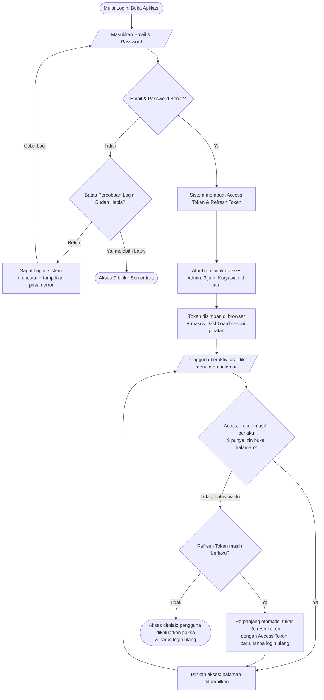
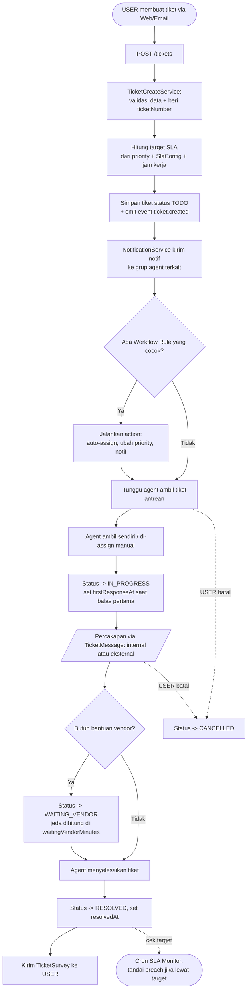
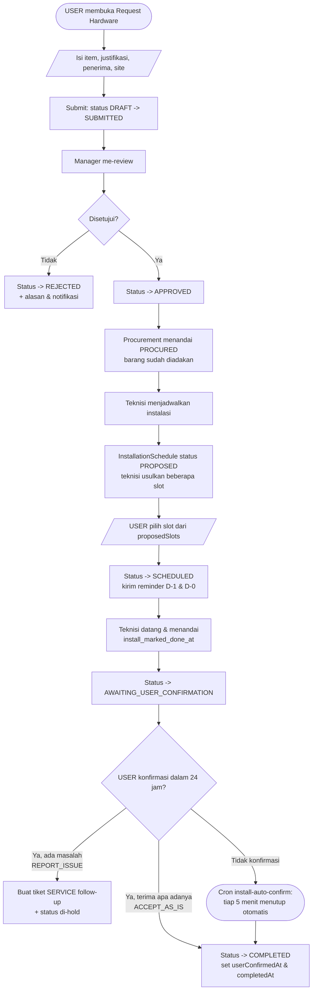
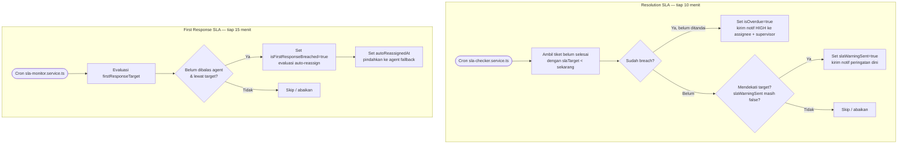
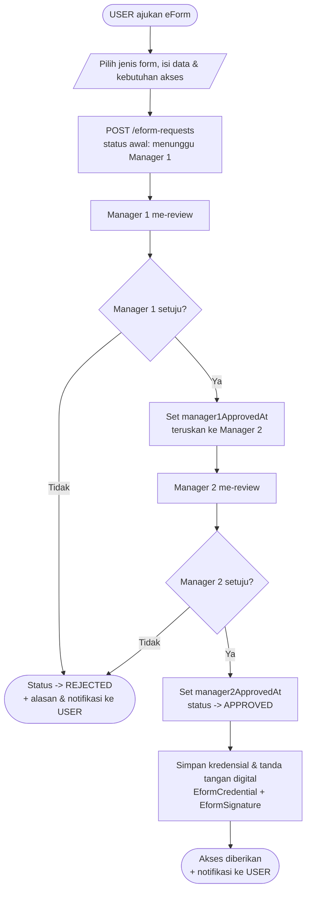
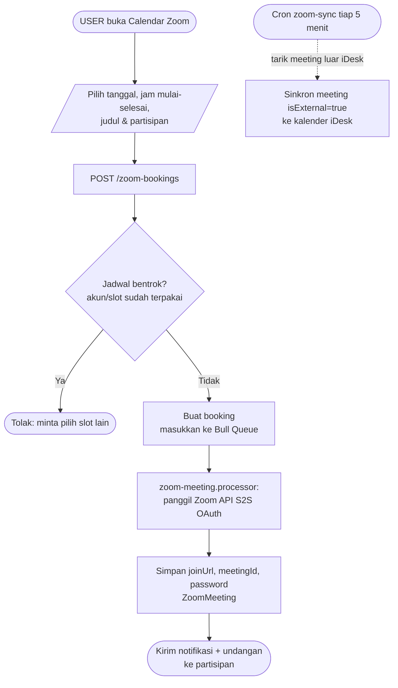
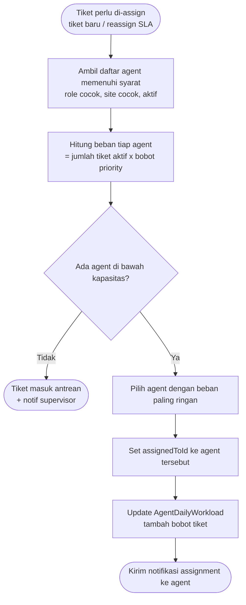

# BLUEPRINT DOCUMENT

## BISNIS PROSES

## iDesk — ENTERPRISE IT HELPDESK & OPERATIONS PLATFORM

**Ver. 1.0**
**09 Mei 2026**

---

**Author:**
[NAMA AUTHOR]

**ICT OPERATIONAL SUPPORT**

---

## Approver

| Approver | Title | Signature | Date |
|---|---|---|---|
| [Nama Approver 1] | [Title] |   |   |
| [Nama Approver 2] | [Title] |   |   |

## Reviewer

| Reviewer | Title | Signature | Date |
|---|---|---|---|
| [Nama Reviewer 1] | [Title] |   |   |
| [Nama Reviewer 2] | [Title] |   |   |

---

## DAFTAR ISI

1. PENDAHULUAN
   1.1 Tujuan
   1.2 Cakupan
       1.2.1 Manajemen Pengguna, Peran & Akses
       1.2.2 Siklus Layanan Tiket Helpdesk
       1.2.3 Permintaan Hardware & Penjadwalan Instalasi
       1.2.4 Permintaan eForm, VPN, dan Page Access
       1.2.5 Pelacakan Lost Item & Found Claim
       1.2.6 Pemesanan Zoom Meeting Terpusat
       1.2.7 Manajemen Kontrak & Renewal
       1.2.8 Knowledge Base & Pencarian Internal
       1.2.9 Otomasi (Workflow Rule) dan SLA Monitoring
       1.2.11 Dashboard, Laporan, dan Audit Trail
       1.2.12 Infrastruktur, Keamanan & Integrasi Eksternal
2. PENJELASAN PROGRAM iDesk
   2.1 Kapasitas Sistem
   2.2 Teknologi yang Digunakan (Tech Stack)
   2.3 Desain Arsitektur Backend
   2.4 Hierarki Peran (Role Hierarchy)
   2.5 Alur Aktivitas Pengguna
       2.5.1 Alur Login & Autentikasi
       2.5.2 Alur Siklus Tiket Helpdesk
       2.5.3 Alur Permintaan Hardware & Instalasi
       2.5.4 Alur SLA Monitoring (Background Cron)
       2.5.5 Alur Permintaan Akses (eForm / VPN / Page Access)
       2.5.6 Alur Booking Zoom (Calendar)
       2.5.7 Alur Auto-Assign Tiket Berdasarkan Workload
   2.6 Mekanisme SLA Monitoring & Breach Detection
   2.7 Mekanisme Permintaan Hardware & Auto-Confirm 24 Jam
   2.8 Mekanisme Three-Layer Permission Control
   2.9 Mekanisme Refresh Token Rotation
   2.10 Real-time Gateway (WebSocket)
   2.11 Background Process & Cron Jobs
   2.12 Fitur Karyawan (USER)
   2.13 Fitur Agent (AGENT_OPERATIONAL_SUPPORT, AGENT_ORACLE, AGENT_ADMIN)
   2.14 Fitur Administrator
   2.15 Fitur Manager
   2.16 Entity Relationship Diagram (ERD) Inti
   2.17 Tabel Utama & Atribut Kunci
   2.18 Daftar Entitas Pendukung
   2.19 Keamanan
   2.20 Kategori Endpoint (API)
   2.21 Lingkungan Kontainer (Docker)
   2.22 Notifikasi & Bull Queue
   2.23 Audit Trail
   2.24 Integrasi Eksternal

---

## 1. PENDAHULUAN

Di perusahaan besar, setiap layanan ICT idealnya tercatat, terukur, dan bisa dilacak — mulai dari saat pengguna mengajukan permintaan sampai tuntas (tiket selesai, perangkat terpasang, eForm ditandatangani, atau barang hilang dikembalikan). Cara lama lewat email, chat, atau formulir kertas menyulitkan: data SLA tidak akurat, pemohon tidak tahu status permintaannya, perubahan sulit ditelusuri, dan laporan ke manajemen jadi repot.

**iDesk — Enterprise IT Helpdesk & Operations Platform** dibuat untuk menjawab masalah itu. Ini satu portal web (Progressive Web App) yang menyatukan sembilan layanan ICT dalam satu tempat: tiket helpdesk, permintaan hardware beserta jadwal instalasinya, permintaan akses (eForm, VPN, page access), pelaporan barang hilang dan klaim penemuan, booking Zoom meeting, pengelolaan kontrak/renewal, knowledge base, otomasi (workflow rule), dan notifikasi multi-kanal.

Di balik layar, iDesk memakai arsitektur modular NestJS yang memisahkan tanggung jawab ke empat lapisan (presentation, application, domain, infrastructure). Keamanannya berlapis (JWT + refresh token rotation, role-based access control, page-access lockout, IP whitelist, rate limiting, validasi file lewat magic-byte). Pembaruan layar berjalan real-time lewat WebSocket (Socket.IO), tugas berat diproses di latar belakang lewat antrean Redis (Bull Queue), dan sistem terhubung ke layanan luar: Zoom Server-to-Server OAuth, Google Workspace API, dan Synology NAS.

### 1.1 Tujuan

- **Satu pintu untuk semua layanan ICT** — Tidak ada lagi permintaan tersebar di email, chat, atau formulir manual. Semua (tiket, hardware, akses sistem, lost item, booking Zoom) masuk lewat satu portal.

- **Patuh SLA** — Setiap tiket dipantau otomatis terhadap target waktu first response dan resolution. Cron SLA monitor memberi peringatan dini dan menandai breach langsung ke database.

- **Semua terlacak (audit trail)** — Tiap aksi penting (login, ubah tiket, ubah setelan, approval eForm, batal booking, dll.) tercatat di tabel `audit_logs` dan bisa ditelusuri admin.

- **Tindak lanjut otomatis** — Workflow rule (event-driven) dan cron job menangani hal-hal rutin tanpa campur tangan manual: reminder instalasi D-1/D-0, auto-confirm 24 jam setelah teknisi menandai selesai, peringatan kontrak renewal H-30/H-60/H-90, dan reassign tiket yang berisiko telat.

- **Real-time** — Papan tiket, antrean instalasi, dan notifikasi diperbarui langsung lewat WebSocket (Socket.IO) — tanpa perlu refresh halaman.

- **Bisa diakses dari mana saja** — Buat tiket dan interaksi dasar lewat web responsif (PWA). Notifikasi dikirim via email (SMTP), web push (VAPID), dan in-app.

- **Terhubung ke ekosistem korporat** — Sinkronisasi data dengan Google Workspace (Spreadsheet), backup ke Synology NAS, dan kuota Zoom dikelola lewat akun Server-to-Server OAuth perusahaan.

### 1.2 Cakupan

Dokumen ini mencakup pembahasan mengenai:

#### 1.2.1 Manajemen Pengguna, Peran & Akses

Sistem mengelola tujuh tingkatan peran (`ADMIN`, `MANAGER`, `AGENT_ADMIN`, `AGENT_OPERATIONAL_SUPPORT`, `AGENT_ORACLE`, `AGENT` (deprecated), dan `USER`) dengan relasi terhadap entitas `Department` dan `Site` (multi-site). Akses dikendalikan secara berlapis: **Roles Guard** untuk gating berbasis peran, **Page Access Guard** untuk gating berbasis halaman/feature, **Feature Access Guard** untuk gating granular per fitur, ditambah **IP Whitelist** dan **Site Guard** untuk pembatasan jaringan dan multi-tenant.

#### 1.2.2 Siklus Layanan Tiket Helpdesk

Mencakup pembuatan tiket dari kanal Web atau Email, alur penugasan kepada agent, percakapan dwi-arah (`ticket_messages` mendukung internal note), perubahan status (TODO → IN_PROGRESS → WAITING_VENDOR → RESOLVED → CANCELLED), perhitungan SLA dengan dukungan business hours, time tracking, ticket merge, ticket survey, dan ticket template. Tiket bersifat optimistic-locked melalui `@VersionColumn` untuk menghindari kehilangan update pada konkurensi tinggi.

#### 1.2.3 Permintaan Hardware & Penjadwalan Instalasi

Mencakup permintaan hardware (`hardware_requests`) dengan workflow lengkap: DRAFT → submit → review → approval → procurement → installation. Penjadwalan instalasi (`installation_schedules`) menggunakan FullCalendar di sisi frontend, mendukung proposed slots, reschedule, status `AWAITING_USER_CONFIRMATION` setelah teknisi menandai selesai, dan **24-jam auto-confirm cron** yang berjalan setiap 5 menit untuk menutup permintaan yang tidak dikonfirmasi pengguna dalam jendela 24 jam.

#### 1.2.4 Permintaan eForm, VPN, dan Page Access

Mencakup permintaan eForm (`eform_requests`) dengan dua tingkat persetujuan manajer (Manager 1 dan Manager 2), penyimpanan kredensial dan tanda tangan digital, permintaan akses VPN (`vpn_access`) dengan reminder otomatis, dan permintaan akses halaman (`access_requests`) yang dilengkapi mekanisme penguncian otomatis (page-access lockout) ketika pengguna melebihi ambang penolakan.

#### 1.2.5 Pelacakan Lost Item & Found Claim

Mencakup pelaporan barang hilang (`lost_item_reports`) yang ditautkan ke tiket, dilengkapi metadata seperti lokasi terakhir, foto, nomor laporan polisi, dan kode QR unik untuk klaim. Penemu (finder) dapat membuat klaim (`found_item_claims`) yang dicocokkan oleh manajer kepada laporan kehilangan, dengan transisi status REPORTED → SEARCHING → CLAIMED → RETURNED.

#### 1.2.6 Pemesanan Zoom Meeting Terpusat

Mencakup pengelolaan akun Zoom korporat (`zoom_accounts`) melalui Server-to-Server OAuth, pemesanan slot meeting (`zoom_bookings`) dengan deteksi tabrakan jadwal, sinkronisasi meeting dari Zoom yang dibuat di luar iDesk (`isExternal=true`), pelacakan partisipan, audit log Zoom, serta cron sinkronisasi setiap 5 menit.

#### 1.2.7 Manajemen Kontrak & Renewal

Mencakup pengelolaan kontrak vendor / lisensi (`renewal_contracts`) dengan dukungan parsing PDF (`pdf-parse`) dan OCR fallback (`tesseract.js`) untuk dokumen non-text, notifikasi expiry H-90/H-60/H-30 melalui cron, manual entry, dan log audit kontrak (`contract_audit_logs`).

#### 1.2.8 Knowledge Base & Pencarian Internal

Mencakup artikel knowledge base (`articles`) dengan visibilitas Public/Internal/Private, status DRAFT/PUBLISHED/ARCHIVED, kategori, tag, hitung tampilan (`article_views`), kolom helpfulCount, serta saved search (`saved_searches`) untuk filter tiket favorit.

#### 1.2.9 Otomasi (Workflow Rule) dan SLA Monitoring

Mencakup mesin workflow rule (`workflow_rules`) berbasis event-driven yang memungkinkan administrator mendefinisikan trigger-condition-action (mis. ketika tiket priority CRITICAL dibuat, otomatis assign ke agent grup tertentu dan kirim notifikasi). Eksekusi rule tercatat di `workflow_executions`. SLA monitoring berjalan melalui dua cron job (every 10 minutes & every 15 minutes) yang menandai tiket terancam breach dan mengirim peringatan.

####

Mencakup empat kanal notifikasi yang dikelola lewat tabel `notifications`, `notification_preferences`, `notification_logs`, dan `push_subscriptions`: in-app (real-time via WebSocket), email (SMTP via Nodemailer + Handlebars) dan Web Push (VAPID). 

#### 1.2.11 Dashboard, Laporan, dan Audit Trail

Mencakup dashboard real-time (Recharts) yang menampilkan volume tiket, tren response/resolution time, kepatuhan SLA, dan beban kerja agent (`agent_daily_workloads` + `priority_weights`). Laporan dapat di-export ke PDF (PDFKit) dan Excel (ExcelJS), dijadwalkan harian/mingguan/bulanan melalui cron. Seluruh aktivitas pengguna tercatat ke `audit_logs` dengan 40+ jenis aksi yang dapat difilter.

#### 1.2.12 Infrastruktur, Keamanan & Integrasi Eksternal

Mencakup deployment berbasis Docker Compose dengan empat container terisolasi (postgres, redis, backend, frontend), enkripsi password (bcrypt), pengamanan HTTP header (Helmet), kompresi response (compression), throttling (`@nestjs/throttler`), validasi input (class-validator), validasi file via magic-bytes, refresh token rotation, dan integrasi terhadap layanan eksternal (Zoom S2S OAuth, Google Workspace API, Synology NAS, SMTP relay).

---

## 2. PENJELASAN PROGRAM iDesk

iDesk adalah aplikasi kelas enterprise yang mengotomatisasi seluruh siklus layanan ICT internal. Intinya ada enam hal:

- **Satu portal, satu standar** — Ganti kanal layanan yang tersebar dengan satu sistem terpadu.
- **Patuh SLA** — Pantau response & resolution time otomatis, lengkap dengan deteksi breach dan auto-reassign.
- **Terlacak penuh** — Audit trail untuk semua perubahan data, login, dan akses halaman terbatas.
- **Real-time** — Papan tiket, antrean instalasi, dan notifikasi langsung ter-update tanpa refresh.
- **Otomasi operasional** — Cron job untuk reminder, auto-confirm, sinkronisasi Zoom & Google, serta housekeeping.
- **Multi-kanal** — Web (PWA), email, dan web push.

### 2.1 Kapasitas Sistem

Kapasitas sistem dirancang untuk mendukung operasional ICT internal perusahaan dengan beban concurrent moderate hingga tinggi:

- **Basis Pengguna** — Mendukung lebih dari 1000 karyawan aktif.
- **Konektivitas Database** — Pool PostgreSQL dapat dikonfigurasi melalui `DB_POOL_MIN` dan `DB_POOL_MAX` (default min=2, max=50).
- **Caching** — Redis 7 (Alpine) untuk Bull Queue, cache layer (`CacheModule` dari `@nestjs/cache-manager`), dan rate-limit hit counter.
- **Pembaruan Real-time** — Socket.IO Gateway pada modul ticketing (`presentation/gateways/events.gateway.ts`), modul hardware-request (`realtime/`), dan modul health (`health.gateway.ts`).
- **Antrean Latar Belakang** — Bull Queue dengan tiga processor: email (`email.processor.ts`), notification (`notification.processor.ts`), dan zoom-meeting (`zoom-meeting.processor.ts`).
- **Throttling** — `@nestjs/throttler` dengan custom guard (`shared/core/guards/custom-throttler.guard.ts`) yang dapat dikonfigurasi melalui `THROTTLE_TTL` dan `THROTTLE_LIMIT`.

### 2.2 Teknologi yang Digunakan (Tech Stack)

Pemilihan teknologi didasarkan pada performa, type-safety, ekosistem yang matang, dan kemudahan pemeliharaan jangka panjang.

| Layer | Teknologi | Keterangan |
|---|---|---|
| Frontend Framework | React 19 + TypeScript 5.9 + Vite 7 | Rendering cepat, type-safety, HMR. |
| State (Server) | TanStack Query 5 | Cache server state, refetch otomatis. |
| State (Client) | Zustand 5 | State lokal ringan tanpa boilerplate. |
| Styling | TailwindCSS 4 + Radix UI Primitives | Utility-first + komponen aksesibel. |
| Form & Validasi | React Hook Form 7 + Zod 4 | Form imperatif minim re-render + skema. |
| Animasi | Framer Motion 12 (LazyMotion) | Animasi deklaratif dengan code-splitting. |
| Visualisasi | Recharts 3 | Grafik dashboard. |
| Kalender | FullCalendar 6 (DayGrid, TimeGrid, Interaction) | Penjadwalan instalasi & Zoom. |
| Editor Kaya | TipTap 3 (StarterKit, Mention) | Komposer pesan tiket dengan @mention. |
| Drag & Drop | dnd-kit 6 + @hello-pangea/dnd 18 | Reorder kanban & to-do. |
| Real-time | socket.io-client 4 | Kanal WebSocket. |
| PWA | vite-plugin-pwa 1 | Service Worker, offline cache. |
| Pemindai QR/Barcode | @zxing/browser, @zxing/library | Pemindaian QR token lost-item. |
| Tabel & Virtualisasi | TanStack Table 8 + Virtual 3 + react-window | Grid besar dengan windowing. |
| Toaster | Sonner 2 | Notifikasi UI ringan. |
| Backend Framework | NestJS 11 + TypeScript | Modular, dependency injection, decorators. |
| ORM | TypeORM 0.3.28 | Migration, repository pattern, query builder. |
| Database | PostgreSQL 15 (Alpine) | Database relasional utama. |
| Caching & Queue | Redis 7 (Alpine) + Bull 4 | Job queue & cache layer. |
| Auth | Passport JWT + Local Strategy | Token bearer + refresh token rotation. |
| Real-time Backend | Socket.IO 4 (`@nestjs/websockets`) | Gateway & WS-auth guard. |
| API Docs | Swagger UI (`@nestjs/swagger` 11) | Dokumentasi otomatis di `/api/docs`. |
| Email | Nodemailer + `@nestjs-modules/mailer` + Handlebars | Notifikasi & template HTML. |
| PDF | PDFKit 0.14 + pdf-parse 1.1 | Generate laporan & parse kontrak. |
| OCR | Tesseract.js 7 | Fallback pembacaan PDF non-text. |
| Excel | ExcelJS 4 | Export laporan. |
| Web Push | web-push 3 (VAPID) | Push notification PWA. |
| Google API | googleapis 169 | Sinkronisasi Spreadsheet. |
| Penjadwalan | `@nestjs/schedule` 5 | Cron job di NestJS. |
| Throttling | `@nestjs/throttler` 6 | Rate limiting global. |
| Header Keamanan | Helmet 8 | HTTP security headers. |
| Kompresi | compression 1 | Gzip response. |
| Validasi | class-validator + class-transformer | DTO validation. |
| Containerisasi | Docker + Docker Compose | Empat service: postgres, redis, backend, frontend. |
| Reverse Proxy | (di-deploy via reverse proxy organisasi) | SSL/HTTPS termination dilakukan di lapisan jaringan. |

### 2.3 Desain Arsitektur Backend

Backend iDesk mengadopsi pendekatan modular NestJS dengan pola pemisahan tanggung jawab. Pada modul yang lebih kompleks (mis. `auth`, `hardware-request`, `ticketing`) diterapkan layered architecture dengan empat lapisan: **presentation** (controller + gateway), **application** (service / use case), **domain** (entity + enum + state machine), dan **infrastructure** (guard + strategy + repository).

#### 2.3.1 Modul (29 file `*.module.ts`)

`access-request`, `audit`, `auth`, `automation`, `eform-request`, `google-sync`, `hardware-request`, `health`, `ip-whitelist`, `knowledge-base`, `lost-item`, `manager`, `notifications`, `permissions`, `renewal`, `reports`, `search`, `settings`, `sites`, `sla-config`, `sound`, `synology`, `ticketing`, `uploads`, `users`, `vpn-access`, `workload`, `zoom-booking`.

#### 2.3.2 Controller (47 file `*.controller.ts`)

Modul dengan controller jamak: **hardware-request** (7 controller: `hardware-request`, `hardware-activity`, `hardware-catalog`, `hardware-comment`, `hardware-dashboard`, `installation`, `ict-budget-redirect`); **ticketing** (7 controller: `tickets`, `saved-replies`, `sla-config`, `surveys`, `ticket-attributes`, `ticket-templates`, `time-tracking`); **notifications** (3); **zoom-booking** (3); **lost-item** (2); **sla-config** (2); **users** (2). Modul lain memiliki satu controller utama.

#### 2.3.3 Guard (10 file)

| File | Tugas |
|---|---|
| `modules/auth/infrastructure/guards/jwt-auth.guard.ts` | Verifikasi JWT pada setiap request terotentikasi. |
| `modules/auth/infrastructure/guards/local-auth.guard.ts` | Validasi kredensial pada endpoint login. |
| `shared/core/guards/roles.guard.ts` | Role-based access control via `@Roles()` decorator. |
| `shared/core/guards/page-access.guard.ts` | Akses berbasis halaman (page) dengan lockout otomatis. |
| `shared/core/guards/feature-access.guard.ts` | Akses granular per fitur (override per user). |
| `shared/core/guards/custom-throttler.guard.ts` | Rate limiting per pengguna / per IP. |
| `modules/permissions/guards/permission.guard.ts` | Validasi permission preset. |
| `modules/sites/guards/site.guard.ts` | Multi-site / tenant isolation. |
| `modules/hardware-request/guards/hardware-role.guard.ts` | Role gating khusus modul hardware. |
| `modules/hardware-request/realtime/ws-auth.guard.ts` | Otentikasi WebSocket connection. |

#### 2.3.4 Filter, Interceptor, Middleware

- **Filter** (4): `database-exception.filter.ts`, `http-exception.filter.ts`, `validation-exception.filter.ts`, `ws-exception.filter.ts`.
- **Interceptor** (1): `logging.interceptor.ts` — mencatat method, path, status, durasi.
- **Middleware** (6): `correlation.middleware.ts` (correlation-id per request), `csrf.middleware.ts` (dinonaktifkan; mitigasi melalui SameSite cookie), serta perlindungan standardisasi REST API.

#### 2.3.5 Service Lintas-Modul (Shared)

| Berkas | Tugas |
|---|---|
| `shared/core/cache/cache.service.ts` | Wrapper Redis untuk cache layer. |
| `shared/core/cache/cache-invalidation.service.ts` | Invalidate kunci cache pada event mutasi. |
| `shared/core/logger/app.logger.ts` | Structured logger lintas modul. |
| `shared/core/logger/typeorm-logger.ts` | Logger query TypeORM. |
| `shared/core/utils/rate-limiter.ts` | Helper untuk hit counter. |
| `shared/core/validators/magic-bytes.validator.ts` | Validasi tipe file via magic byte. |
| `shared/core/validators/input-sanitizer.ts` | Sanitasi string. |
| `shared/queue/queue.module.ts` | Konfigurasi BullMQ. |
| `shared/queue/processors/email.processor.ts` | Pemroses antrean email. |
| `shared/queue/processors/notification.processor.ts` | Pemroses antrean notifikasi. |
| `shared/queue/processors/zoom-meeting.processor.ts` | Pemroses pembuatan meeting Zoom. |

#### 2.3.6 Bootstrap (`src/main.ts`)

Berkas bootstrap mengaktifkan: Helmet, compression (level 6, threshold 1KB), cookie-parser, ValidationPipe global (whitelist + transform), tiga exception filter global, LoggingInterceptor global, correlation middleware, dan Swagger pada `/api/docs`. Server mendengarkan port `5050` dengan timeout request 30 detik dan keep-alive 65 detik. Validasi environment di awal (gagal cepat jika `JWT_SECRET`, `DB_HOST`, `DB_PASSWORD`, `DB_DATABASE` tidak tersedia).

### 2.4 Hierarki Peran (Role Hierarchy)

Sistem menerapkan kontrol akses berbasis peran (RBAC) dengan tujuh tingkatan, didefinisikan pada `modules/users/enums/user-role.enum.ts`.

| Peran | Deskripsi | Akses |
|---|---|---|
| `ADMIN` | Administrator sistem | Akses penuh: konfigurasi sistem, manajemen pengguna, SLA config, automation rule, audit log, integrasi (Zoom, Google, Synology), backup, IP whitelist, branding, sound, knowledge base CRUD. |
| `MANAGER` | Manajer / Approver | Persetujuan eForm (Manager 1 / Manager 2), approval hardware request, manager dashboard, akses laporan eksekutif, validasi found-claim & lost-item. |
| `AGENT_ADMIN` | Agent dengan privileges admin terbatas | Manajemen tiket lintas grup, override assignment, akses dashboard agent + sebagian fitur admin yang didelegasikan. |
| `AGENT_OPERATIONAL_SUPPORT` | Agent helpdesk lapis 1/2 | Penanganan tiket umum (SERVICE), hardware installation (sebagai teknisi), manajemen lost-item, knowledge base preview, notifikasi assignment. |
| `AGENT_ORACLE` | Agent spesialis Oracle | Penanganan tiket dengan `ticketType=ORACLE_REQUEST`, berbagi modul tiket dengan agent lain. |
| `AGENT` | Peran lama (deprecated) | Dipertahankan untuk kompatibilitas data lama; akan dimigrasikan ke `AGENT_OPERATIONAL_SUPPORT`. |
| `USER` | Karyawan biasa | Membuat tiket, permintaan hardware/eForm/VPN/akses, lapor lost-item, klaim found-item, pesan Zoom, baca knowledge base, lihat notifikasi pribadi. |

Peran disimpan pada kolom `users.role` (tipe enum PostgreSQL, default `AGENT`). Decorator `@Roles(...)` pada controller dipasangkan dengan `RolesGuard` untuk gating endpoint.

### 2.5 Alur Aktivitas Pengguna

#### 2.5.1 Alur Login & Autentikasi

Pengguna login dengan email & password. Kalau salah, sistem mengecek batas percobaan — terlalu sering gagal akan memblokir akun sementara. Kalau benar, sistem memberi dua "tiket akses" (access token & refresh token): access token berumur pendek untuk dipakai sehari-hari, refresh token untuk memperpanjang sesi otomatis tanpa login ulang.

#### 2.5.2 Alur Siklus Tiket Helpdesk

Saat tiket dibuat, sistem langsung menghitung target SLA, menyimpan tiket dengan status TODO, dan memberi tahu grup agent terkait. Workflow rule otomatis dicek dulu — kalau ada yang cocok, tiket bisa langsung di-assign atau priority-nya diubah. Sisanya ditangani agent: balas, minta bantuan vendor bila perlu, lalu selesaikan. Cron SLA berjalan di latar belakang menandai tiket yang lewat target.

#### 2.5.3 Alur Permintaan Hardware & Instalasi

Permintaan hardware berjalan bertahap: diajukan USER → disetujui manager → barang diadakan (procurement) → teknisi menjadwalkan instalasi → USER memilih slot → teknisi memasang. Setelah teknisi menandai selesai, USER punya 24 jam untuk konfirmasi. Kalau diam saja, cron menutup otomatis (dianggap diterima).

#### 2.5.4 Alur SLA Monitoring (Background Cron)

Dua cron berjalan paralel. Yang pertama (tiap 10 menit) mengawasi **resolution SLA** — apakah tiket selesai tepat waktu, sambil mengirim peringatan dini sebelum benar-benar telat. Yang kedua (tiap 15 menit) mengawasi **first response SLA** — apakah agent membalas tepat waktu; kalau belum, tiket dipindah otomatis ke agent cadangan.

#### 2.5.5 Alur Permintaan Akses (eForm / VPN / Page Access)

USER mengajukan akses lewat eForm. Bedanya dengan permintaan lain: eForm butuh **dua tingkat persetujuan** (Manager 1 lalu Manager 2). Kalau salah satu menolak, permintaan berhenti. Kalau keduanya setuju, sistem menyimpan kredensial dan tanda tangan digital, lalu akses diberikan. Permintaan VPN dan page access memakai pola serupa namun cukup satu approval.

> **Catatan page-access lockout:** untuk akses halaman terbatas, `PageAccessGuard` mencatat setiap penolakan. Jika penolakan beruntun melewati `PAGE_ACCESS_MAX_DENIALS`, akun di-lockout sementara selama `PAGE_ACCESS_LOCKOUT_MINUTES` (lihat bagian 2.8).

#### 2.5.6 Alur Booking Zoom (Calendar)

USER memesan slot Zoom lewat kalender (FullCalendar). Sebelum dibuat, sistem mengecek tabrakan jadwal supaya satu akun Zoom tidak dipakai dua meeting sekaligus. Pembuatan meeting ke Zoom dilakukan di latar belakang (Bull Queue) agar tidak terjadi rebutan slot. Meeting yang dibuat langsung di Zoom (di luar iDesk) ikut tersinkron lewat cron tiap 5 menit.

#### 2.5.7 Alur Auto-Assign Tiket Berdasarkan Workload

Saat tiket perlu di-assign — baik tiket baru lewat workflow rule maupun reassign akibat SLA — sistem tidak asal menunjuk agent. Ia menghitung **beban kerja** tiap agent: jumlah tiket aktif dikali bobot priority-nya (`PriorityWeight`), lalu memilih agent dengan beban paling ringan. Hasilnya dicatat di `AgentDailyWorkload`.

> **Catatan:** model beban kerja di atas mengikuti entitas `AgentDailyWorkload` dan `PriorityWeight` pada modul `workload` (bagian 2.18); detail ambang kapasitas dikonfigurasi per organisasi.

> **Catatan Kustomisasi Prioritas:** Label tingkat prioritas tiket (LOW, MEDIUM, HIGH, CRITICAL, dll.) tidak hardcoded, melainkan dapat ditambah, diubah, atau dihapus secara dinamis melalui antarmuka Admin (Modul SlaConfig) menyesuaikan dengan SOP internal perusahaan masing-masing.

### 2.6 Mekanisme SLA Monitoring & Breach Detection

Sistem SLA iDesk menggunakan dua pengukur paralel pada setiap tiket:

- **First Response SLA** — diukur dari `slaStartedAt` hingga `firstResponseAt` (saat pesan pertama agent kepada pelapor). Target dihitung dari `SlaConfig.responseTimeMinutes` (default 60 menit).
- **Resolution SLA** — diukur dari `slaStartedAt` hingga `resolvedAt`, ditarget oleh `SlaConfig.resolutionTimeMinutes` (default 1.440 menit / 24 jam).

Field-field yang relevan pada `tickets`:

| Field | Fungsi |
|---|---|
| `slaStartedAt` | Waktu mulai perhitungan SLA. |
| `firstResponseAt` / `firstResponseTarget` / `isFirstResponseBreached` | Pelacakan first response. |
| `resolvedAt` / `slaTarget` / `isOverdue` | Pelacakan resolution & flag breach. |
| `slaWarningSent` | Idempotency flag untuk peringatan. |
| `waitingVendorAt` / `totalWaitingVendorMinutes` | Pengurang clock saat status `WAITING_VENDOR`. |
| `lastPausedAt` / `totalPausedMinutes` | Pengurang clock saat tiket dipause. |
| `autoReassignedAt` | Timestamp auto-reassignment. |

**Business Hours** (`modules/sla-config/entities/business-hours.entity.ts`) memungkinkan target SLA dihitung berdasarkan jam kerja aktif (mis. 08:00–17:00 hari kerja) sehingga waktu di luar jam kerja tidak dihitung sebagai keterlambatan.

### 2.7 Mekanisme Permintaan Hardware & Auto-Confirm 24 Jam

Pada modul `hardware-request`, status permintaan disusun dengan finite-state machine pada `domain/state-machine/`. Transisi utama: `DRAFT` → `SUBMITTED` → `REVIEWED` → `APPROVED`/`REJECTED` → `PROCURED` → `SCHEDULED` (via `InstallationSchedule`) → `INSTALLED` (`installMarkedDoneAt`) → `AWAITING_USER_CONFIRMATION` → `COMPLETED`.

**Auto-Confirm Cron** — `modules/hardware-request/listeners/install-auto-confirm.cron.ts` berjalan dengan ekspresi `*/5 * * * *` (zona waktu `Asia/Jakarta`) dan memilih semua `HardwareRequest` dengan `installMarkedDoneAt IS NOT NULL`, `userConfirmedAt IS NULL`, dan selisih `now - installMarkedDoneAt >= 24 jam`. Untuk setiap kandidat, sistem menyetel `userConfirmedAt = now`, `userConfirmationKind = 'ACCEPT_AS_IS'` (implisit), `completedAt = now`, status menjadi `COMPLETED`, kemudian mencatat audit log dan mengirim notifikasi.

**Aging Reminder Cron** — `modules/hardware-request/listeners/aging-reminder.cron.ts` berjalan setiap pukul 07:00 (Asia/Jakarta) dan mengirim reminder kepada teknisi atas permintaan yang sudah `PROCURED` namun belum dijadwalkan, atau dijadwalkan tetapi `scheduledStart` sudah lewat tanpa progress.

Konkurensi pada `HardwareRequest` dan `Ticket` dilindungi `@VersionColumn` (optimistic locking) sehingga update yang konflik akan dilempar sebagai exception alih-alih saling menimpa.

### 2.8 Mekanisme Three-Layer Permission Control

Sistem iDesk menerapkan tiga lapis kontrol akses yang dievaluasi berurutan setelah JWT verifikasi.

1. **Roles Guard** — `shared/core/guards/roles.guard.ts` membaca metadata `@Roles(...)` dari controller/method dan memverifikasi `request.user.role` masuk dalam daftar yang diizinkan.

2. **Page Access Guard** — `shared/core/guards/page-access.guard.ts` membaca metadata `@PageAccess(...)` dan memvalidasi terhadap konfigurasi halaman pada `permissions` module. Setiap penolakan dicatat sebagai `PAGE_ACCESS_DENIED`. Bila jumlah penolakan oleh seorang pengguna mencapai `PAGE_ACCESS_MAX_DENIALS` dalam jendela waktu tertentu, akun di-lockout selama `PAGE_ACCESS_LOCKOUT_MINUTES` (audit `PAGE_ACCESS_LOCKOUT`).

3. **Feature Access Guard** — `shared/core/guards/feature-access.guard.ts` membaca metadata `@FeatureAccess(...)` dan memeriksa tabel `user_feature_permissions` untuk overrides per pengguna terhadap `feature_definitions`.

Lapisan tambahan:
- **Site Guard** (`modules/sites/guards/site.guard.ts`) — memastikan pengguna hanya melihat data dari `siteId` yang berhak diakses.
- **IP Whitelist** (`modules/ip-whitelist/`) — endpoint sensitif (mis. admin) dapat dibatasi pada subnet tertentu.

### 2.9 Mekanisme Refresh Token Rotation

Pada login, sistem menerbitkan dua token:

- **access_token** — JWT umur pendek, durasi disesuaikan peran (Admin/Agent ~3 jam, User ~1 jam, default `JWT_EXPIRES_IN=60m`).
- **refresh_token** — JWT umur panjang yang di-hash sebelum disimpan ke `users.hashedRefreshToken`.

Saat access token kedaluwarsa, frontend memanggil `POST /auth/refresh` dengan refresh token. Sistem membandingkan refresh token (setelah hash) dengan kolom database; bila cocok, sistem menerbitkan pasangan token baru, mem-hash refresh token baru, dan mengganti hash lama. Refresh token lama otomatis tidak valid (rotasi). Pada logout, kolom `hashedRefreshToken` dikosongkan.

### 2.10 Real-time Gateway (WebSocket)

Sistem menggunakan Socket.IO sebagai kanal real-time, dijalankan via `@nestjs/platform-socket.io`. Tiga gateway utama:

| Gateway | Lokasi | Fungsi |
|---|---|---|
| Ticket Events | `modules/ticketing/presentation/gateways/events.gateway.ts` | Push update tiket: created, updated, message, status change, SLA warning. |
| Hardware Realtime | `modules/hardware-request/realtime/` | Push update permintaan hardware & jadwal instalasi. |
| Health Gateway | `modules/health/health.gateway.ts` | Heartbeat & status sistem. |

Otentikasi WebSocket dilakukan oleh `ws-auth.guard.ts` yang memvalidasi JWT pada handshake. Origin yang diizinkan dikonfigurasi via `WS_CORS_ORIGIN` (wajib di produksi, comma-separated). Eksepsi WebSocket diformat oleh `ws-exception.filter.ts`.

### 2.11 Background Process & Cron Jobs

iDesk menggunakan `@nestjs/schedule` (decorator `@Cron`). Sebelas cron job aktif:

| Berkas | Jadwal | Tugas |
|---|---|---|
| `ticketing/sla-checker.service.ts` | Every 10 minutes | Deteksi resolution-SLA breach + warning. |
| `ticketing/services/sla-monitor/sla-monitor.service.ts` | `*/15 * * * *` | First-response breach + auto-reassign. |
| `hardware-request/listeners/install-auto-confirm.cron.ts` | `*/5 * * * *` (Asia/Jakarta) | Auto-confirm instalasi 24 jam. |
| `hardware-request/listeners/aging-reminder.cron.ts` | `0 7 * * *` (Asia/Jakarta) | Reminder permintaan tertunda. |
| `renewal/services/renewal-scheduler.service.ts` | `0 9 * * *` | Notifikasi expiry kontrak H-30/H-60/H-90. |
| `vpn-access/vpn-scheduler.service.ts` | `0 8 * * *` | Reminder VPN access. |
| `zoom-booking/services/zoom-sync.service.ts` | `0 */5 * * * *` | Sinkronisasi meeting Zoom. |
| `synology/synology.service.ts` | EVERY_HOUR + EVERY_DAY_AT_MIDNIGHT | Backup & rotation ke Synology NAS. |
| `google-sync/services/sync-scheduler.service.ts` | EVERY_30_SECONDS | Sinkronisasi Google Spreadsheet. |
| `reports/generators/scheduled-reports.service.ts` | EVERY_DAY_AT_7AM + EVERY_WEEK + `0 9 1 * *` | Laporan harian, mingguan, bulanan. |
| `settings/storage-cleanup.service.ts` | `0 2 * * *` | Pembersihan file upload ter-orphan. |

> **Catatan Cluster:** iDesk berjalan single-instance per service di Docker Compose; tidak diperlukan instance guard seperti pada PM2 cluster. Bila kelak di-deploy multi-replica, perlu ditambahkan distributed lock (Redis) sebelum eksekusi cron.

### 2.12 Fitur Karyawan (USER)

| Fitur | Halaman / Endpoint Utama | Deskripsi |
|---|---|---|
| Dashboard Pribadi | `features/dashboard/` | Ringkasan tiket pribadi, action items, notifikasi. |
| Buat Tiket | `features/ticket-board/` + `POST /tickets` | Form pembuatan tiket dengan kategori, priority, lampiran. |
| Riwayat Tiket | `features/ticket-board/` + `GET /tickets/me` | Daftar tiket milik sendiri dengan filter status. |
| Permintaan Hardware | `features/hardware-request/` + `POST /hardware-requests` | Form permintaan barang ICT. |
| Konfirmasi Instalasi | `features/hardware-request/` | Konfirmasi `ACCEPT_AS_IS` / `REPORT_ISSUE` setelah instalasi. |
| eForm Request | `features/request-center/` + `POST /eform-requests` | Permintaan akses aplikasi/form internal. |
| VPN Access Request | `features/vpn-access/` | Permintaan akses VPN. |
| Lapor Lost Item | `features/request-center/` + `POST /lost-items` | Pelaporan barang hilang dengan metadata & QR. |
| Klaim Found Item | `features/request-center/` | Klaim atas penemuan barang. |
| Pesan Zoom Meeting | `features/zoom-booking/` + `POST /zoom-bookings` | Booking slot Zoom korporat. |
| Knowledge Base | `features/knowledge-base/` + `GET /kb/articles` | Pencarian & baca artikel. |
| Notifikasi | `features/notifications/` | In-app, email, web push. |
| Profil & Preferensi | `features/auth/` + `PATCH /users/me` | Ubah password, foto, preferensi notifikasi. |

### 2.13 Fitur Agent (AGENT_OPERATIONAL_SUPPORT, AGENT_ORACLE, AGENT_ADMIN)

| Fitur | Halaman / Endpoint Utama | Deskripsi |
|---|---|---|
| Papan Tiket | `features/ticket-board/` | Kanban TODO/IN_PROGRESS/WAITING_VENDOR/RESOLVED. |
| Drawer Tiket | komponen `RequestRowDrawer` | Detail, percakapan, internal note, time tracking. |
| Saved Replies | `features/ticket-board/` | Template balasan cepat. |
| Ticket Templates | `presentation/ticket-templates.controller.ts` | Form siap pakai. |
| Time Tracking | `presentation/time-tracking.controller.ts` | Pencatatan waktu pengerjaan. |
| Hardware Installation Calendar | `features/hardware-request/` | FullCalendar untuk teknisi. |
| Lost Item Workflow | `features/request-center/` | Update status, foto, qrCode. |
| Workload Dashboard | `features/dashboard/` + `modules/workload` | Beban harian agent berdasarkan priority weight. |
| Knowledge Base Authoring | `features/knowledge-base/` | DRAFT → PUBLISHED. |

### 2.14 Fitur Administrator

| Fitur | Halaman / Endpoint Utama | Deskripsi |
|---|---|---|
| User Management | `features/admin/` + `users.controller.ts` | CRUD pengguna, import CSV, role assignment. |
| Department Management | `departments.controller.ts` | CRUD departemen. |
| Site Management | `sites.controller.ts` | CRUD site multi-tenant. |
| SLA Configuration | `sla-config.controller.ts` + `business-hours.controller.ts` | Target waktu per priority + jam kerja. |
| Workflow Rules | `automation/controllers/workflow-rule.controller.ts` | Editor automation rule. |
| Permissions | `permissions.controller.ts` | Preset & feature permission per pengguna. |
| IP Whitelist | `ip-whitelist.controller.ts` | Daftar IP yang diizinkan. |
| Audit Log | `audit.controller.ts` | Filter & search audit trail. |
| System Settings | `settings.controller.ts` | Konfigurasi global, branding, sound. |
| Zoom Admin | `zoom-admin.controller.ts` | Tambah akun Zoom, kuota meeting. |
| Google Sync Config | `google-sync.controller.ts` | Konfigurasi spreadsheet & sheet. |
| Synology Backup | `synology.controller.ts` | Konfigurasi target backup. |
| Sound Notification | `sound.controller.ts` | Upload nada notifikasi. |
| Reports | `reports.controller.ts` | Generate PDF/Excel. |

### 2.15 Fitur Manager

| Fitur | Halaman / Endpoint Utama | Deskripsi |
|---|---|---|
| Manager Dashboard | `manager.controller.ts` | Ringkasan pengajuan eForm, hardware request, KPI tim. |
| Approval eForm Manager 1 / Manager 2 | `eform-request.controller.ts` | Persetujuan dua tingkat. |
| Approval Hardware Request | `hardware-request.controller.ts` | Approve / reject. |
| Approval VPN Access | `vpn-access.controller.ts` | Approve permintaan VPN. |
| Validasi Found Claim | `found-claim.controller.ts` | Cocokkan klaim ke laporan kehilangan. |
| Laporan Eksekutif | `reports.controller.ts` | Akses laporan agregat. |

### 2.16 Entity Relationship Diagram (ERD) Inti

ERD berikut memetakan entitas inti dan hubungannya, dikelompokkan per domain agar mudah dibaca: Identitas & Akses, Tiket, Hardware & Instalasi, Lost Item, Zoom, lalu Knowledge Base & SLA. Notasi: `||` = satu, `o{` = banyak (opsional), `|{` = banyak (wajib ≥1).

```mermaid
erDiagram
    %% ─── Identitas & Akses ───
    USER }o--|| DEPARTMENT       : "anggota"
    USER }o--|| SITE             : "lokasi"
    USER }o--o| PERMISSION_PRESET : "preset"

    %% ─── Tiket ───
    USER   ||--o{ TICKET          : "membuat"
    USER   ||--o{ TICKET_MESSAGE  : "mengirim"
    USER   ||--o{ NOTIFICATION    : "menerima"
    TICKET ||--o{ TICKET_MESSAGE  : "memiliki"
    TICKET ||--o{ TIME_ENTRY      : "tracking"
    TICKET ||--o{ TICKET_SURVEY   : "survei"
    TICKET }o--o| TICKET_TEMPLATE : "berbasis"
    TICKET }o--o| SLA_CONFIG      : "target"
    TICKET }o--|| SITE            : "lokasi"

    %% ─── Hardware & Instalasi ───
    USER             ||--o{ HARDWARE_REQUEST          : "meminta"
    USER             ||--o{ INSTALLATION_SCHEDULE     : "teknisi"
    HARDWARE_REQUEST ||--|{ HARDWARE_REQUEST_ITEM     : "berisi"
    HARDWARE_REQUEST ||--o{ INSTALLATION_SCHEDULE     : "dijadwalkan"
    HARDWARE_REQUEST ||--o{ HARDWARE_REQUEST_ACTIVITY : "aktivitas"
    HARDWARE_REQUEST ||--o{ HARDWARE_REQUEST_COMMENT  : "komentar"
    HARDWARE_REQUEST }o--|| SITE                      : "lokasi"
    HARDWARE_REQUEST_ITEM }o--|| HARDWARE_CATALOG     : "katalog"
    INSTALLATION_SCHEDULE ||--|{ INSTALLATION_SCHEDULE_ITEM : "items"

    %% ─── Lost Item ───
    USER             ||--o{ LOST_ITEM_REPORT     : "melapor"
    USER             ||--o{ FOUND_ITEM_CLAIM     : "menemukan"
    TICKET           ||--o| LOST_ITEM_REPORT     : "detail-lost-item"
    LOST_ITEM_REPORT ||--o{ FOUND_ITEM_CLAIM     : "klaim"
    LOST_ITEM_REPORT ||--o{ LOST_ITEM_STATUS_LOG : "log-status"

    %% ─── Zoom ───
    USER         ||--o{ ZOOM_BOOKING     : "memesan"
    ZOOM_BOOKING }o--|| ZOOM_ACCOUNT     : "menggunakan"
    ZOOM_BOOKING ||--o| ZOOM_MEETING     : "meeting"
    ZOOM_BOOKING ||--o{ ZOOM_PARTICIPANT : "partisipan"
    ZOOM_BOOKING ||--o{ ZOOM_AUDIT_LOG   : "audit"

    %% ─── Knowledge Base & SLA ───
    ARTICLE    ||--o{ ARTICLE_VIEW   : "ditampilkan"
    SLA_CONFIG }o--o| BUSINESS_HOURS : "jam-kerja"

    USER {
        uuid id PK
        string email UK
        string password "hashed"
        string fullName
        enum role
        string employeeId
        string departmentId FK
        string siteId FK
        boolean isActive
        string hashedRefreshToken
    }

    TICKET {
        uuid id PK
        string ticketNumber UK
        string title
        text description
        enum status
        enum priority
        enum source
        enum ticketType
        string userId FK
        string assignedToId FK
        string siteId FK
        timestamp slaTarget
        timestamp firstResponseAt
        timestamp resolvedAt
        boolean isOverdue
        int version
    }

    TICKET_MESSAGE {
        uuid id PK
        text content
        json attachments
        boolean isInternal
        boolean isSystemMessage
        string source
        string ticketId FK
        string senderId FK
        timestamp createdAt
    }

    HARDWARE_REQUEST {
        uuid id PK
        string requestNumber UK
        uuid requesterId FK
        uuid recipientId FK
        uuid siteId FK
        text justification
        enum status
        timestamp installMarkedDoneAt
        timestamp userConfirmedAt
        string userConfirmationKind
        timestamp completedAt
        int version
    }

    INSTALLATION_SCHEDULE {
        uuid id PK
        uuid requestId FK
        uuid technicianId FK
        timestamp scheduledStart
        timestamp scheduledEnd
        enum status
        json proposedSlots
        int rescheduleCount
    }

    LOST_ITEM_REPORT {
        uuid id PK
        string ticketId FK
        string itemType
        string itemName
        string lastSeenLocation
        timestamp lastSeenDatetime
        text circumstances
        boolean hasPoliceReport
        enum status
        text[] photoUrls
        string qrCodeToken UK
    }

    FOUND_ITEM_CLAIM {
        uuid id PK
        uuid finderId FK
        uuid lostItemReportId FK
        text locationFound
        timestamp foundAt
        text description
        text[] photoUrls
        enum status
        uuid matchedById FK
    }

    ZOOM_BOOKING {
        uuid id PK
        string zoomAccountId FK
        string bookedByUserId FK
        string title
        date bookingDate
        time startTime
        time endTime
        int durationMinutes
        enum status
        boolean isExternal
        bigint externalZoomMeetingId UK
    }

    ARTICLE {
        uuid id PK
        string title
        text content
        string category
        string[] tags
        enum status
        enum visibility
        int viewCount
        int helpfulCount
        string authorId FK
    }

    ARTICLE_VIEW {
        uuid id PK
        uuid articleId FK
        string viewerId FK
        timestamp viewedAt
    }

    SLA_CONFIG {
        uuid id PK
        string priority UK
        int responseTimeMinutes
        int resolutionTimeMinutes
    }

    BUSINESS_HOURS {
        uuid id PK
        int dayOfWeek
        time startTime
        time endTime
        boolean isActive
    }

    DEPARTMENT {
        uuid id PK
        string name
    }

    SITE {
        uuid id PK
        string name
        string code
    }

    PERMISSION_PRESET {
        uuid id PK
        string name
    }

    NOTIFICATION {
        uuid id PK
        string userId FK
        string type
        text content
        boolean isRead
    }
```

### 2.17 Tabel Utama & Atribut Kunci

| Model | Atribut Kunci | Relasi Utama |
|---|---|---|
| `User` | `id (uuid)`, `email (unique)`, `password (hashed)`, `fullName`, `role (enum)`, `employeeId`, `departmentId`, `avatarUrl`, `isActive`, `lastActiveAt`, `hashedRefreshToken` | → `Department`, `Site`, `PermissionPreset`; → `Ticket[]`, `TicketMessage[]`, `HardwareRequest[]`, `Notification[]`, `CustomerSession[]` |
| `Department` | `id`, `name` | → `User[]` |
| `Site` | `id`, `name`, `code` | → `User[]`, `Ticket[]`, `HardwareRequest[]` |
| `Ticket` | `id`, `ticketNumber (unique)`, `title`, `description`, `category`, `status (TODO/IN_PROGRESS/WAITING_VENDOR/RESOLVED/CANCELLED)`, `priority (LOW/MEDIUM/HIGH/CRITICAL/HARDWARE_INSTALLATION)`, `source (WEB/EMAIL)`, `ticketType (SERVICE/ICT_BUDGET/LOST_ITEM/ACCESS_REQUEST/HARDWARE_INSTALLATION/ORACLE_REQUEST)`, `criticalReason`, `userId`, `assignedToId`, `siteId`, `slaStartedAt`, `firstResponseAt`, `firstResponseTarget`, `isFirstResponseBreached`, `resolvedAt`, `slaTarget`, `isOverdue`, `slaWarningSent`, `waitingVendorAt`, `totalWaitingVendorMinutes`, `lastPausedAt`, `totalPausedMinutes`, `autoReassignedAt`, `isHardwareInstallation`, `scheduledDate`, `scheduledTime`, `hardwareType`, `reminderD1Sent`, `reminderD0Sent`, `userAcknowledged`, `version` | → `User`, `Site`, `TicketMessage[]`, `TimeEntry[]`, `TicketSurvey[]` |
| `TicketMessage` | `id`, `content`, `attachments (json[])`, `isSystemMessage`, `isInternal`, `source`, `ticketId`, `senderId` | → `Ticket`, `User` |
| `TicketSurvey` | `id`, `ticketId`, `rating`, `feedback` | → `Ticket` |
| `TicketTemplate` | `id`, `name`, `body`, `category` | standalone |
| `TicketAttribute` | `id`, `ticketId`, `key`, `value` | → `Ticket` |
| `TimeEntry` | `id`, `ticketId`, `userId`, `startedAt`, `endedAt`, `durationMinutes` | → `Ticket`, `User` |
| `SavedReply` | `id`, `name`, `content` | standalone |
| `SlaConfig` | `id`, `priority (unique)`, `responseTimeMinutes (default 60)`, `resolutionTimeMinutes (default 1440)` | → `Ticket` |
| `BusinessHours` | `id`, `dayOfWeek`, `startTime`, `endTime`, `isActive` | konfigurasi global SLA |
| `HardwareRequest` | `id`, `requestNumber (unique)`, `requesterId`, `recipientId`, `recipientName`, `division`, `siteId`, `justification`, `status (DRAFT/SUBMITTED/REVIEWED/APPROVED/REJECTED/PROCURED/SCHEDULED/INSTALLED/AWAITING_USER_CONFIRMATION/COMPLETED/CANCELLED)`, `submittedAt`, `reviewedAt`, `approvedAt`, `procuredAt`, `installedAt`, `installMarkedDoneAt`, `userConfirmedAt`, `userConfirmationKind (ACCEPT_AS_IS/REPORT_ISSUE)`, `completedAt`, `reviewedById`, `approvedById`, `procuredById`, `rejectReason`, `version` | → `User (requester)`, `User (recipient)`, `Site`, `HardwareRequestItem[]`, `InstallationSchedule[]`, `HardwareRequestActivity[]`, `HardwareRequestComment[]` |
| `HardwareRequestItem` | `id`, `requestId`, `catalogId`, `quantity`, `notes` | → `HardwareRequest`, `HardwareCatalog` |
| `HardwareCatalog` | `id`, `name`, `category`, `description`, `imageUrl` | master data hardware |
| `HardwareAsset` | `id`, `serialNumber`, `assetTag`, `model`, `assignedTo` | aset terinstal |
| `InstallationSchedule` | `id`, `requestId`, `technicianId`, `scheduledStart`, `scheduledEnd`, `status (PROPOSED/SCHEDULED/IN_PROGRESS/COMPLETED/CANCELLED)`, `proposedBy`, `confirmedBy`, `locationDetail`, `rescheduleReason`, `startedAt`, `completedAt`, `proposedSlots (jsonb)`, `selectedSlotAt`, `rescheduleCount` | → `HardwareRequest`, `User`, `InstallationScheduleItem[]` |
| `InstallationScheduleItem` | `id`, `scheduleId`, `requestItemId`, `serialInstalled` | → `InstallationSchedule` |
| `LostItemReport` | `id`, `ticketId`, `itemType`, `itemName`, `serialNumber`, `assetTag`, `lastSeenLocation`, `lastSeenDatetime`, `circumstances`, `witnessContact`, `hasPoliceReport`, `policeReportNumber`, `policeReportFile`, `estimatedValue`, `finderRewardOffered`, `status (REPORTED/SEARCHING/CLAIMED/RETURNED/CLOSED_LOST)`, `foundAt`, `foundLocation`, `foundBy`, `photoUrls (text[])`, `qrCodeToken (unique)`, `qrCodeUrl` | → `Ticket`, `FoundItemClaim[]`, `LostItemStatusLog[]` |
| `FoundItemClaim` | `id`, `finderId`, `lostItemReportId`, `locationFound`, `foundAt`, `description`, `photoUrls`, `status (PENDING/MATCHED/RETURNED/REJECTED)`, `managerNotes`, `matchedById`, `matchedAt` | → `User`, `LostItemReport` |
| `LostItemStatusLog` | `id`, `reportId`, `from`, `to`, `changedById`, `changedAt`, `reason` | → `LostItemReport` |
| `ZoomBooking` | `id`, `zoomAccountId`, `bookedByUserId`, `title`, `description`, `bookingDate`, `startTime`, `endTime`, `durationMinutes`, `status`, `cancellationReason`, `cancelledByUserId`, `cancelledAt`, `isExternal`, `externalZoomMeetingId (unique)` | → `ZoomAccount`, `User`, `ZoomMeeting`, `ZoomParticipant[]` |
| `ZoomAccount` | `id`, `email`, `accountId`, `clientId`, `clientSecret (encrypted)`, `isActive` | → `ZoomBooking[]` |
| `ZoomMeeting` | `id`, `bookingId`, `meetingId`, `joinUrl`, `password` | → `ZoomBooking` |
| `ZoomParticipant` | `id`, `bookingId`, `userId`, `email` | → `ZoomBooking`, `User` |
| `ZoomAuditLog` | `id`, `action`, `payload`, `actorId`, `createdAt` | audit Zoom |
| `ZoomSettings` | `id`, `key`, `value` | konfigurasi Zoom |
| `Article` (Knowledge Base) | `id`, `title`, `content`, `category`, `tags (simple-array)`, `status (DRAFT/PUBLISHED/ARCHIVED)`, `visibility (PUBLIC/INTERNAL/PRIVATE)`, `viewCount`, `helpfulCount`, `authorId`, `authorName`, `featuredImage`, `images`, `deletedAt (soft-delete)` | → `ArticleView[]` |
| `ArticleView` | `id`, `articleId`, `viewerId`, `viewedAt` | → `Article` |
| `Notification` | `id`, `userId`, `type`, `content`, `isRead`, `metadata`, `createdAt` | → `User` |
| `NotificationPreference` | `id`, `userId`, `channel (in-app/email/push)`, `enabled` | → `User` |
| `NotificationLog` | `id`, `notificationId`, `channel`, `status`, `error` | → `Notification` |
| `PushSubscription` | `id`, `userId`, `endpoint`, `p256dh`, `auth` | → `User` |
| `ActionItemSnooze` | `id`, `userId`, `itemId`, `snoozedUntil` | → `User` |
| `WorkflowRule` | `id`, `name`, `event (trigger)`, `condition (json)`, `actions (json)`, `isActive`, `priority` | → `WorkflowExecution[]` |
| `WorkflowExecution` | `id`, `ruleId`, `triggeredAt`, `payload`, `result`, `success` | → `WorkflowRule` |
| `RenewalContract` | `id`, `vendorName`, `contractNumber`, `startDate`, `endDate`, `pdfUrl`, `parsedData`, `acknowledgedById`, `acknowledgedAt`, `notifyDays (int[])` | → `ContractAuditLog[]` |
| `ContractAuditLog` | `id`, `contractId`, `action`, `actorId`, `payload`, `createdAt` | → `RenewalContract` |
| `EformRequest` | `id`, `requestNumber`, `requesterId`, `formType`, `status`, `manager1ApprovedAt`, `manager2ApprovedAt`, `rejectedReason` | → `EformApproval[]`, `EformSignature[]`, `EformCredential[]` |
| `AuditLog` | `id`, `timestamp`, `userId`, `userName`, `userRole`, `action (40+ values)`, `entity`, `entityId`, `entityName`, `oldValue`, `newValue`, `changes`, `ipAddress`, `userAgent`, `requestPath`, `requestMethod`, `metadata`, `description`, `success`, `errorMessage` | standalone |
| `SystemSettings` | `id (singleton)`, key/value pairs | konfigurasi global |

### 2.18 Daftar Entitas Pendukung

Selain entitas inti pada bagian 2.17, sistem memiliki entitas pendukung sebagai berikut:

| Modul | Entitas |
|---|---|
| `auth` | `User` (domain re-export) |
| `users` | `Department` |
| `permissions` | `FeatureDefinition`, `PermissionPreset`, `UserFeaturePermission` |
| `access-request` | `AccessRequest`, `AccessType` |
| `ip-whitelist` | `IpWhitelist` |
| `vpn-access` | `VpnAccess` |
| `eform-request` | `EformApproval`, `EformCredential`, `EformSignature` |
| `google-sync` | `SpreadsheetConfig`, `SpreadsheetSheet`, `SyncLog` |
| `synology` | `BackupConfiguration`, `BackupHistory` |
| `sound` | `NotificationSound` |
| `search` | `SavedSearch` |
| `workload` | `AgentDailyWorkload`, `PriorityWeight` |
| `hardware-request` | `HardwareRequestActivity`, `HardwareRequestComment` |

Total entitas TypeORM: **65 file `*.entity.ts`** tersebar di 24 modul.

### 2.19 Keamanan

Kebijakan keamanan diterapkan secara berlapis:

- **Otentikasi** — JWT bearer token + refresh token rotation. Password di-hash dengan bcrypt (cost factor 10) sebelum disimpan.
- **Otorisasi** — Tiga lapis guard (Roles, Page Access, Feature Access) ditambah Site Guard dan Hardware Role Guard.
- **Header Keamanan** — Helmet diaktifkan global pada `main.ts`.
- **Cookie** — HTTP-only + SameSite untuk mitigasi CSRF (CSRF middleware kustom dinonaktifkan; SameSite dianggap memadai untuk arsitektur saat ini).
- **Rate Limiting** — `@nestjs/throttler` dengan custom guard yang mempertimbangkan user identity, dapat dikonfigurasi via `THROTTLE_TTL` dan `THROTTLE_LIMIT`.
- **IP Whitelist** — Endpoint sensitif dapat dibatasi pada subnet/IP tertentu.
- **Validasi Input** — `ValidationPipe` global (whitelist + transform), DTO dengan `class-validator`, sanitasi string (`input-sanitizer.ts`).
- **Validasi File Upload** — Pengecekan magic bytes (`magic-bytes.validator.ts`) untuk menolak file yang ekstensinya berbeda dari konten aktual.
- **Page Access Lockout** — Penolakan beruntun pada halaman terbatas memicu lockout otomatis dengan parameter `PAGE_ACCESS_MAX_DENIALS` dan `PAGE_ACCESS_LOCKOUT_MINUTES`.
- **Audit Trail** — Setiap aksi sensitif (login, perubahan role, perubahan setelan, penolakan akses) tercatat ke `audit_logs` (`AuditAction` enum: 40+ nilai).
- **CORS WebSocket** — `WS_CORS_ORIGIN` wajib dikonfigurasi pada produksi (server menolak koneksi bila kosong).
- **Environment Validation** — Bootstrap memvalidasi keberadaan `JWT_SECRET`, `DB_HOST`, `DB_PASSWORD`, `DB_DATABASE`; gagal jika tidak ada (fail-fast).
- **Optimistic Locking** — Tabel `tickets` dan `hardware_requests` menggunakan `@VersionColumn` untuk mencegah lost update pada konkurensi tinggi.
- **Secret Management** — `JWT_SECRET` minimal 32 karakter, kredensial Zoom dan Google disimpan via environment / file service-account JSON eksternal.

### 2.20 Kategori Endpoint (API)

Dokumentasi interaktif tersedia pada Swagger UI di `http://<host>:5050/api/docs` (Bearer auth diaktifkan).

| Kelompok Endpoint | Controller | Deskripsi |
|---|---|---|
| `/auth` | `auth/presentation/auth.controller.ts` | Login, logout, refresh, change-password, register, csrf-token. |
| `/users` & `/users/me` | `users/users.controller.ts` | CRUD pengguna, profil, import CSV. |
| `/departments` | `users/departments.controller.ts` | CRUD departemen. |
| `/sites` | `sites/sites.controller.ts` | CRUD site. |
| `/permissions` | `permissions/permissions.controller.ts` | Preset & feature permission. |
| `/tickets` | `ticketing/presentation/tickets.controller.ts` | CRUD tiket, percakapan, status, assignment. |
| `/tickets/saved-replies` | `ticketing/presentation/saved-replies.controller.ts` | CRUD saved reply. |
| `/tickets/templates` | `ticketing/presentation/ticket-templates.controller.ts` | CRUD template. |
| `/tickets/attributes` | `ticketing/presentation/ticket-attributes.controller.ts` | Custom attribute. |
| `/tickets/surveys` | `ticketing/presentation/surveys.controller.ts` | Survei kepuasan. |
| `/tickets/time-tracking` | `ticketing/presentation/time-tracking.controller.ts` | Pencatatan waktu. |
| `/sla-config` | `sla-config/sla-config.controller.ts` | Konfigurasi SLA per priority. |
| `/business-hours` | `sla-config/business-hours.controller.ts` | Jam kerja untuk SLA. |
| `/hardware-requests` (+ sub) | `hardware-request/presentation/*.controller.ts` (7 controller) | Request, items, activity, comment, dashboard, installation, ict-budget redirect. |
| `/lost-items` | `lost-item/lost-item.controller.ts` | CRUD laporan kehilangan. |
| `/found-claims` | `lost-item/found-claim.controller.ts` | Klaim penemuan. |
| `/zoom-bookings` | `zoom-booking/controllers/zoom-booking.controller.ts` | CRUD booking. |
| `/zoom-admin` | `zoom-booking/controllers/zoom-admin.controller.ts` | Manajemen akun Zoom. |
| `/zoom-webhook` | `zoom-booking/controllers/zoom-webhook.controller.ts` | Webhook event Zoom. |
| `/eform-requests` | `eform-request/eform-request.controller.ts` | eForm dengan dua tingkat approval. |
| `/vpn-access` | `vpn-access/vpn-access.controller.ts` | Permintaan VPN. |
| `/access-requests` | `access-request/access-request.controller.ts` | Permintaan akses halaman/fitur. |
| `/ip-whitelist` | `ip-whitelist/ip-whitelist.controller.ts` | CRUD IP whitelist. |
| `/notifications` | `notifications/notification.controller.ts` | Daftar & mark-as-read. |
| `/notifications/preferences` | `notifications/notification-preferences.controller.ts` | Preferensi kanal. |
| `/notifications/push-subscriptions` | `notifications/push-subscription.controller.ts` | Subscribe/unsubscribe push. |
| `/automation/workflow-rules` | `automation/controllers/workflow-rule.controller.ts` | CRUD workflow rule. |
| `/manager` | `manager/manager.controller.ts` | Dashboard manajer. |
| `/workload` | `workload/workload.controller.ts` | Beban kerja agent. |
| `/kb/articles` | `knowledge-base/knowledge-base.controller.ts` | Artikel & view tracking. |
| `/search` | `search/search.controller.ts` | Saved search. |
| `/sound` | `sound/sound.controller.ts` | CRUD nada notifikasi. |
| `/settings` | `settings/settings.controller.ts` | System settings. |
| `/audit` | `audit/audit.controller.ts` | Query audit log. |
| `/health` | `health/health.controller.ts` | Health check. |
| `/uploads` | `uploads/uploads.controller.ts` | Upload file. |
| `/renewal` | `renewal/renewal.controller.ts` | Kontrak & renewal. |
| `/google-sync` | `google-sync/google-sync.controller.ts` | Konfigurasi sinkronisasi Google. |
| `/synology` | `synology/synology.controller.ts` | Konfigurasi backup Synology. |
| `/reports` | `reports/reports.controller.ts` | Generate PDF/Excel + scheduled reports. |

### 2.21 Lingkungan Kontainer (Docker) & Deployment End-to-End

Seluruh ekosistem iDesk dirancang untuk fully-containerized agar menjamin kesamaan lingkungan (*environment parity*) antara tahap Development dan Production. Aplikasi dijalankan melalui orkestrasi **Docker Compose** yang membagi sistem menjadi empat layanan (*services*) terisolasi yang saling berkomunikasi di dalam *bridge network* yang sama.

Berikut adalah topologi container yang dikonfigurasi menyesuaikan data di `.env`:

| Container / Service | Image Build Strategy | Port Mapping | Fungsi & Detail Konfigurasi |
|---|---|---|---|
| `idesk-postgres` | `postgres:15-alpine` | `5454:5432` | Database PostgreSQL utama. Menggunakan persistent volume (`./backups/postgres`) agar data tidak hilang saat container mati. Menggunakan healthcheck `pg_isready`. |
| `idesk-redis` | `redis:7-alpine` | `6379:6379` | *In-memory store* untuk *caching* akses cepat dan manajemen antrean background (Bull Queue). Data dipersistensikan ke `./backups/redis`. Menggunakan healthcheck `redis-cli ping`. |
| `idesk-backend` | Node Alpine (*multi-stage* build) via `apps/backend/Dockerfile` | `3001:3001` | Melayani API Core (NestJS), WebSockets (Socket.IO), dan menjadwalkan sistem *Cron Jobs*. Container ini bergantung (depends_on) pada health state dari Postgres dan Redis sebelum menyala penuh. |
| `idesk-frontend` | Nginx Alpine (*multi-stage* build) via `apps/frontend/Dockerfile` | `80:80` | Aplikasi SPA React/Vite dibuild menjadi file statis (`dist`), kemudian disajikan (*served*) secara super cepat menggunakan web server Nginx. Bergantung pada kesiapan backend. |

Network: `idesk-network` (bridge). SSL/HTTPS termination dilakukan oleh reverse proxy organisasi di lapisan jaringan (di luar scope compose).

### 2.22 Notifikasi & Bull Queue

Sistem notifikasi memanfaatkan empat kanal yang diorkestrasi melalui Bull Queue (Redis-backed).

| Processor | Lokasi | Tugas |
|---|---|---|
| Email Processor | `shared/queue/processors/email.processor.ts` | Mengirim email dari `notifications` & `reports` melalui Nodemailer + Handlebars. |
| Notification Processor | `shared/queue/processors/notification.processor.ts` | Memproses notifikasi in-app, push. |
| Zoom Meeting Processor | `shared/queue/processors/zoom-meeting.processor.ts` | Membuat meeting Zoom secara asinkron untuk menghindari race condition pada booking. |

Tabel `notifications` menyimpan notifikasi in-app, `notification_preferences` mencatat preferensi kanal per pengguna, `notification_logs` mencatat keberhasilan/kegagalan kirim, `push_subscriptions` menyimpan endpoint VAPID per device, dan `action_item_snoozes` mendukung penundaan reminder.

### 2.23 Audit Trail

Modul `audit` menyimpan jejak digital lengkap pada tabel `audit_logs`. Enum `AuditAction` mencakup 40+ nilai yang dikelompokkan:

- **Authentication** — `USER_LOGIN`, `USER_LOGOUT`, `LOGIN_FAILED`, `PASSWORD_CHANGE`, `PASSWORD_RESET`.
- **User Management** — `USER_CREATE`, `USER_UPDATE`, `USER_DELETE`, `USER_ROLE_CHANGE`, `USER_BULK_IMPORT`, `USER_STATUS_TOGGLE`.
- **Tickets** — `CREATE_TICKET`, `UPDATE_TICKET`, `DELETE_TICKET`, `ASSIGN_TICKET`, `STATUS_CHANGE`, `PRIORITY_CHANGE`, `TICKET_REPLY`, `TICKET_MERGE`, `TICKET_CANCEL`, `BULK_UPDATE`.
- **Knowledge Base** — `ARTICLE_CREATE`, `ARTICLE_UPDATE`, `ARTICLE_DELETE`, `ARTICLE_PUBLISH`.
- **Settings** — `SETTINGS_CHANGE`, `SLA_CONFIG_CHANGE`.
- **Zoom** — `ZOOM_BOOKING_CREATE`, `ZOOM_BOOKING_CANCEL`, `ZOOM_BOOKING_RESCHEDULE`.
- **Automation** — `AUTOMATION_CREATE`, `AUTOMATION_UPDATE`, `AUTOMATION_DELETE`.
- **Reports** — `REPORT_GENERATE`, `REPORT_EXPORT`.
- **Page Access Control** — `PAGE_ACCESS_DENIED`, `PAGE_ACCESS_LOCKOUT`.
- **Access Request** — `ACCESS_REQUEST_CREATE`, `ACCESS_REQUEST_APPROVE`, `ACCESS_REQUEST_REJECT`, `ACCESS_TYPE_UPDATE`.
- **eForm** — `EFORM_REQUEST_CREATE`, `EFORM_APPROVE_MANAGER1`, `EFORM_APPROVE_MANAGER2`, `EFORM_REJECT`.
- **ICT Budget / Hardware Request** — kelompok aksi terkait hardware request lifecycle.

Setiap entri menyimpan `userId`, `userName`, `userRole`, `entity`, `entityId`, `entityName`, `oldValue`, `newValue`, `changes (json diff)`, `ipAddress`, `userAgent`, `requestPath`, `requestMethod`, `metadata`, `description`, `success`, dan `errorMessage`.

### 2.24 Integrasi Eksternal

| Layanan | Cara Integrasi | Modul iDesk |
|---|---|---|
| Zoom Server-to-Server OAuth | OAuth client credentials + REST API | `zoom-booking` |
| Google Workspace | Service account JSON + `googleapis` | `google-sync` |
| Synology NAS | API/SMB untuk arsip backup | `synology` |
| SMTP Relay | Nodemailer + Handlebars template | shared (email processor) |
| Web Push | VAPID keys + protocol Web Push | `notifications` |

Konfigurasi kredensial di-load dari environment variables (`ZOOM_ACCOUNT_ID/CLIENT_ID/CLIENT_SECRET`, `GOOGLE_CREDENTIALS_PATH`, `SMTP_HOST/PORT/USER/PASS/FROM`, `VAPID_PUBLIC_KEY/PRIVATE_KEY/SUBJECT`). Generator VAPID tersedia pada `apps/backend/src/scripts/generate-vapid-keys.js`.

---

*Dokumen ini disusun berdasarkan inspeksi langsung terhadap kode sumber pada commit aktif. Versi dapat berubah seiring evolusi sistem; perlu di-review setiap kali terjadi perubahan signifikan pada modul, entitas, atau alur bisnis.*

**— Akhir Dokumen —**
