# 📘 Panduan Lengkap Penggunaan iDesk — Portal Karyawan & User

Selamat datang di **Portal Layanan Mandiri iDesk Enterprise**. Dokumen ini dirancang sebagai panduan komprehensif bagi seluruh karyawan dan pengguna (**Role: USER / Client**) dalam memanfaatkan seluruh fitur layanan teknologi informasi, mulai dari proses autentikasi (login), pengelolaan tiket multi-divisi, interaksi chat langsung dengan teknisi, pemesanan ruang meeting Zoom, pengajuan E-Form akses sistem/VPN, hingga pusat bantuan mandiri (*Knowledge Base*).

---

## 📑 Daftar Isi Cepat
1. [Bab 1: Login & Akses Masuk Sistem](#bab-1-login--akses-masuk-sistem)
2. [Bab 2: Dashboard Tiket Saya (My Tickets)](#bab-2-dashboard-tiket-saya-my-tickets)
3. [Bab 3: Pembuatan Tiket Bantuan & Layanan](#bab-3-pembuatan-tiket-bantuan--layanan)
   - [3.1 Memilih Kategori Layanan](#31-memilih-kategori-layanan)
   - [3.2 Form Tiket IT Support Umum](#32-form-tiket-it-support-umum)
   - [3.3 Form Tiket Oracle K2, Web, & Mobile Dev](#33-form-tiket-oracle-k2-web--mobile-dev)
4. [Bab 4: Pelacakan Tiket, Chat Interaktif, & SLA](#bab-4-pelacakan-tiket-chat-interaktif--sla)
5. [Bab 5: Pemesanan Ruang Meeting Zoom (Zoom Calendar)](#bab-5-pemesanan-ruang-meeting-zoom-zoom-calendar)
6. [Bab 6: Pengajuan E-Form Akses Jaringan & Sistem](#bab-6-pengajuan-e-form-akses-jaringan--sistem)
   - [6.1 Memantau Status Pengajuan E-Form](#61-memantau-status-pengajuan-e-form)
   - [6.2 Mengisi Formulir Permintaan Akses Baru](#62-mengisi-formulir-permintaan-akses-baru)
7. [Bab 7: Pusat Bantuan & Solusi Mandiri (Knowledge Base)](#bab-7-pusat-bantuan--solusi-mandiri-knowledge-base)
8. [Bab 8: Notifikasi & Pengaturan Profil Pengguna](#bab-8-notifikasi--pengaturan-profil-pengguna)

---

## Bab 1: Login & Akses Masuk Sistem

Untuk mengakses portal iDesk, buka peramban web (*browser*) Anda dan kunjungi URL portal perusahaan: **`https://idesk.santos.co.id/login`**.

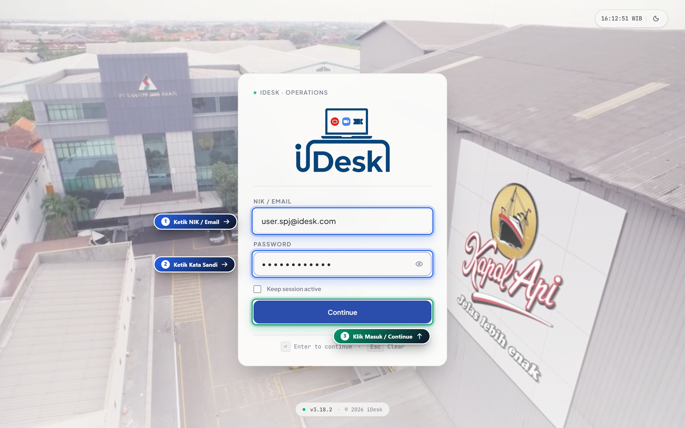

### 📌 Langkah-Langkah Login:
1. **Masukkan Identitas Akun**:
   - Ketik **NIK Karyawan** (Nomor Induk Karyawan) atau **Alamat Email Perusahaan** terdaftar pada kolom `NIK / EMAIL`.
2. **Masukkan Kata Sandi**:
   - Masukkan kata sandi akun Anda pada kolom `PASSWORD`. Anda dapat menekan ikon mata (*eye icon*) untuk memeriksa ketepatan karakter kata sandi yang diketik.
3. **Pilihan Tetap Masuk (Opsional)**:
   - Centang opsi `Keep session active` jika Anda menggunakan komputer kantor pribadi agar sesi Anda tidak cepat kedaluwarsa.
4. **Masuk ke Portal**:
   - Klik tombol **`Continue`** atau tekan tombol **`Enter`** pada keyboard Anda.

> [!TIP]
> **Pintasan Keyboard**: Tekan tombol `Enter` untuk langsung mengirim formulir login, atau tekan tombol `Esc` untuk mengosongkan seluruh kolom input dengan cepat.

---

## Bab 2: Dashboard Tiket Saya (My Tickets)

Setelah berhasil login, Anda akan langsung diarahkan ke halaman utama **My Tickets (`/client/my-tickets`)**. Halaman ini berfungsi sebagai pusat kontrol pemantauan seluruh riwayat dan status permintaan bantuan yang Anda ajukan.

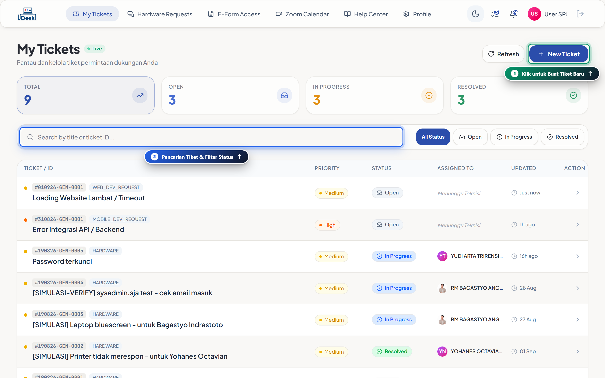

### 🔍 Fitur-Fitur Utama Dashboard:
1. **Ringkasan Kartu Metrik (Bento Stat Cards)**:
   - **Total Tiket**: Akumulasi seluruh tiket yang pernah Anda buat.
   - **Open (Aktif)**: Tiket yang baru dikirimkan dan menunggu penugasan teknisi.
   - **In Progress (Diproses)**: Tiket yang sedang dalam penanganan aktif oleh tim IT Support / Developer.
   - **Resolved (Selesai)**: Tiket yang telah berhasil diselesaikan oleh tim IT.
2. **Pencarian Cepat & Filter Status**:
   - Gunakan kotak **`Search by title or ticket ID...`** untuk menemukan tiket berdasarkan judul masalah atau nomor tiket (misal: `#010926-GEN-0001`).
   - Gunakan tombol filter status (`All Status`, `Open`, `In Progress`, `Resolved`) untuk memfilter daftar tiket secara instan.
3. **Daftar Tabel Tiket Interaktif**:
   - Menampilkan nomor tiket, badge kategori layanan, judul kendala, tingkat prioritas (*Low, Medium, High, Critical*), nama teknisi yang bertugas (*Assigned Agent*), serta waktu pembaruan terakhir.
   - Klik pada baris tiket mana pun untuk membuka detail tiket dan ruang percakapan.
4. **Tombol Tindakan Cepat**:
   - Klik **`+ New Ticket`** di sudut kanan atas untuk membuka halaman pengajuan tiket baru.

---

## Bab 3: Pembuatan Tiket Bantuan & Layanan

### 3.1 Memilih Kategori Layanan
Saat Anda menekan tombol **`+ New Ticket`**, Anda akan disajikan menu pilihan kategori layanan (**`/client/create`**). Sistem iDesk memisahkan alur tiket sesuai divisi spesialis agar masalah Anda ditangani oleh tim yang tepat secara cepat.

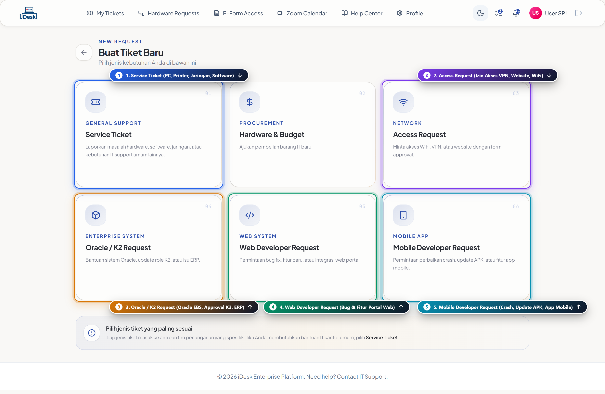

#### Pilihan Kategori yang Tersedia:
- 🎫 **01 - Service Ticket (General Support)**: Layanan IT kantor umum, mencakup permasalahan komputer, laptop, software standar, printer, email, dan jaringan lokal.
- 🌐 **03 - Access Request (E-Form Access)**: Permintaan izin akses akun VPN, jaringan khusus, atau sistem kerja terproteksi.
- 📦 **04 - Oracle / K2 Request (Enterprise System)**: Bantuan modul sistem ERP Oracle EBS, update peran (*role*) K2 Workflow, maupun kendala validasi data bisnis.
- 💻 **05 - Web Developer Request**: Permintaan perbaikan bug, penambahan fitur, atau integrasi pada portal web internal perusahaan.
- 📱 **06 - Mobile Developer Request**: Laporan kendala aplikasi mobile Android/iOS, error sinkronisasi data lapangan, atau update versi APK.

---

### 3.2 Form Tiket IT Support Umum
Jika Anda memilih kartu **Service Ticket**, Anda akan diarahkan ke formulir pembuatan tiket IT Support (**`/client/create?type=service`**).

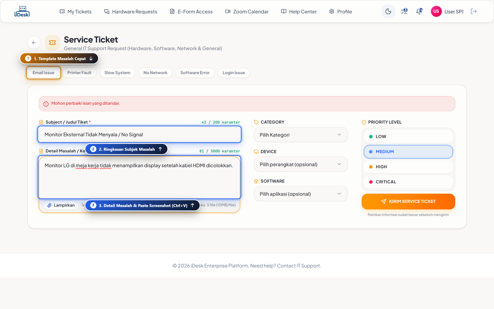

### 📌 Langkah Pengisian:
1. **Template Cepat (*Quick Template*)**:
   - Tersedia tombol shortcut di bagian atas: `Email Issue`, `Printer Fault`, `Slow System`, `No Network`, `Software Error`, dan `Login Issue`. Klik salah satu tombol template untuk mengisi subjek dan detail secara otomatis.
2. **Subject / Judul Tiket (Wajib)**:
   - Tuliskan ringkasan kendala dengan jelas (maksimal 200 karakter). Contoh: *"Komputer tidak bisa terhubung ke printer lantai 2"*.
3. **Detail Masalah / Kebutuhan (Wajib)**:
   - Uraikan kronologi kejadian, pesan error yang muncul, atau langkah yang telah dicoba.
4. **Lampiran Berkas / Screenshot**:
   - Klik tombol **`Lampirkan`** atau cukup tekan **`Ctrl + V`** untuk menempelkan (*paste*) tangkapan layar error langsung ke formulir (mendukung hingga 5 berkas, maks. 10MB/file).
5. **Kategori, Perangkat, & Aplikasi**:
   - Pilih dropdown **Category** (`Hardware`, `Software`, `Network`, `General`).
   - Pilih spesifikasi perangkat (`PC`, `Laptop`, `Printer`, dll.) dan aplikasi terkait jika diperlukan.
6. **Tingkat Urgensi (Priority Level)**:
   - **LOW**: Kendala ringan yang tidak menghentikan pekerjaan utama.
   - **MEDIUM**: Kendala operasional reguler (Default).
   - **HIGH**: Kendala mendesak yang menghambat produktivitas kerja divisi.
   - **CRITICAL**: Sistem operasional kritis terhenti total (*down*).
7. **Kirim Tiket**:
   - Klik tombol **`KIRIM SERVICE TIKET`** untuk mengirim permohonan ke antrean teknisi.

---

### 3.3 Form Tiket Oracle K2, Web, & Mobile Dev
Untuk kebutuhan sistem perusahaan atau pengembangan perangkat lunak, pilih kategori spesifik (**`/client/create?type=oracle-request`**).

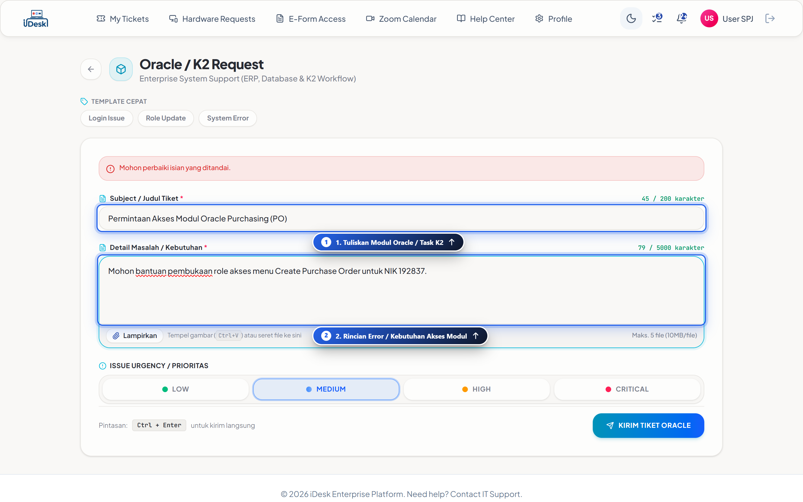

### 📌 Karakteristik Form Dev & Enterprise:
- **Template Khusus**: Dilengkapi template siap pakai seperti `Login Issue`, `Role Update`, `System Error`, dan `Sync Error`.
- **Subject & Kebutuhan Modul**: Masukkan nama modul Oracle / menu web / fungsi mobile yang bermasalah.
- **Pintasan Keyboard Cepat**: Tekan kombinasi tombol **`Ctrl + Enter`** pada keyboard untuk mengirim tiket tanpa perlu menggeser mouse.

---

## Bab 4: Pelacakan Tiket, Chat Interaktif, & SLA

Setelah tiket dikirim, Anda dapat memantau perkembangan penanganan secara real-time pada halaman **Ticket Detail (`/client/tickets/:id`)**.

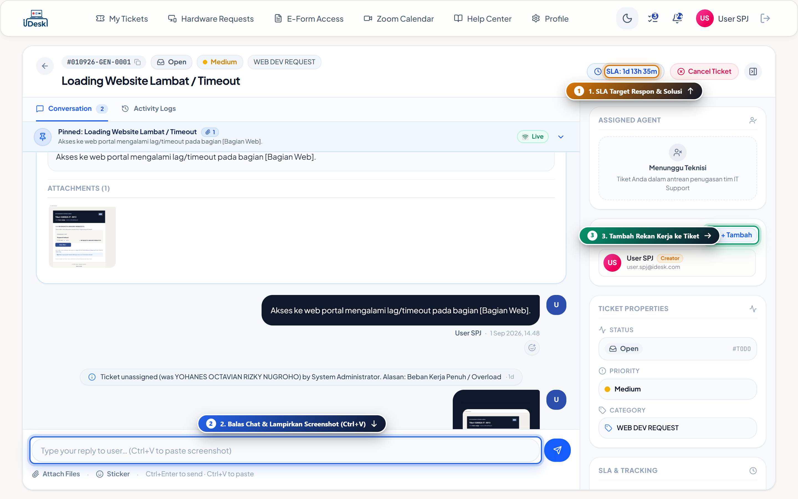

### 🌟 Elemen & Fungsi pada Halaman Detail Tiket:
1. **Header Tiket & SLA Countdown**:
   - Menampilkan nomor tiket unik, status saat ini, badge prioritas, dan **SLA Timer** (*Service Level Agreement*) yang menghitung mundur target waktu penyelesaian layanan.
2. **Riwayat Percakapan (Conversation Thread)**:
   - Komunikasi dua arah langsung antara Anda dan teknisi/agent yang ditugaskan.
   - Terdapat penanda pesan (*User Bubble* warna biru gelap vs *Agent Bubble*).
3. **Catatan Penting (*Pinned Notes*)**:
   - Bagian atas ruang chat menampilkan informasi awal masalah serta lampiran dokumen/gambar yang Anda sertakan.
4. **Input Chat & Stiker Interaktif**:
   - Ketik pesan balasan pada kotak input di bagian bawah.
   - Mendukung penempelan screenshot langsung (**`Ctrl + V`**), lampirkan berkas, maupun stiker respon cepat.
5. **Panel Kanan (Properti & Anggota Tiket)**:
   - **Assigned Agent**: Menampilkan nama dan foto teknisi yang bertanggung jawab.
   - **Anggota Tiket**: Anda dapat menambahkan rekan kerja lain (*Collaborator*) ke dalam tiket dengan menekan tombol **`+ Tambah`**.
   - **Status & Kategori**: Informasi siklus hidup tiket dari *Open* → *In Progress* → *Resolved*.

> [!IMPORTANT]
> **Rating Kepuasan Pengguna**: Ketika teknisi telah menyelesaikan masalah dan mengubah status tiket menjadi **Resolved**, jendela evaluasi bintang (*1-5 Stars Satisfaction Rating*) akan muncul. Berikan ulasan objektif Anda untuk membantu peningkatan kualitas layanan tim IT.

---

## Bab 5: Pemesanan Ruang Meeting Zoom (Zoom Calendar)

Portal iDesk menyediakan integrasi jadwal meeting virtual melalui menu **Zoom Calendar (`/client/zoom-calendar`)**. Fitur ini mempermudah pengguna membuat link meeting Zoom korporat resmi tanpa perlu mengelola lisensi akun secara manual.

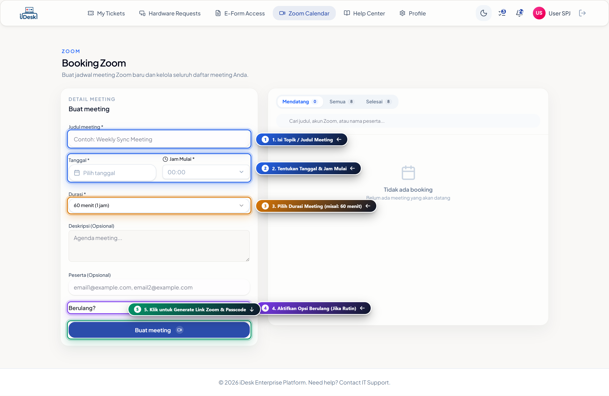

### 📌 Prosedur 5 Langkah Pemesanan Ruang Zoom:
1. **Isi Topik / Judul Meeting (Wajib)**:
   - Masukkan judul atau agenda meeting pada kolom *Judul meeting* (Contoh: `Weekly Coordination Meeting - Tim Santos`).
2. **Tentukan Tanggal & Jam Mulai (Wajib)**:
   - **Pilih Tanggal**: Klik kolom tanggal untuk membuka kalender dan pilih hari meeting.
   - **Pilih Jam Mulai**: Tentukan jam mulai meeting melalui dropdown waktu (tersedia interval per 15/30 menit, contoh: `09:00`).
3. **Pilih Durasi Meeting**:
   - Tentukan estimasi durasi meeting yang dibutuhkan melalui dropdown durasi (contoh: `30 menit`, `60 menit (1 jam)`, `90 menit`, `120 menit`). Sistem akan otomatis menampilkan badge konfirmasi rentang waktu (misal: `09:00 - 10:00 WIB`).
4. **Aktifkan Opsi Berulang / Recurring (Jika Rutin)**:
   - Jika meeting diadakan secara berkala (misal: rapat mingguan atau bulanan), klik sakelar toggle **`Berulang?`** hingga aktif (berwarna ungu).
   - Tentukan interval frekuensi (contoh: *Setiap 1 Minggu*) dan batas akhir tanggal perulangan (*sampai Tanggal*).
5. **Klik Tombol "Buat meeting 🎥"**:
   - Tekan tombol **`Buat meeting 🎥`**. Sistem iDesk akan secara otomatis mengalokasikan akun lisensi Zoom korporat yang tersedia dan menghasilkan tautan meeting (*Join URL*), *Meeting ID*, serta *Passcode* secara instan.

---

### 💡 Simulasi Formulir Pemesanan & Opsi Berulang (Recurring)

Berikut adalah contoh simulasi formulir pemesanan Zoom yang telah diisi lengkap dengan opsi jadwal berulang aktif serta sinkronisasi daftar meeting:

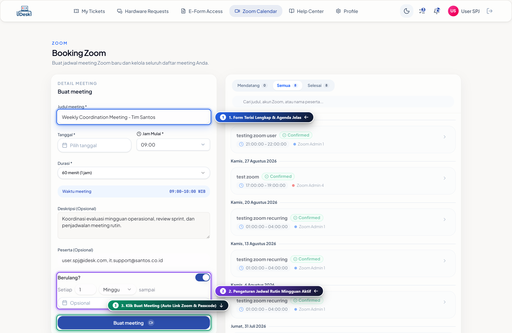

#### 📝 Catatan Simulasi & Fitur Tambahan:
- **Deskripsi & Agenda (Opsional)**: Anda dapat menambahkan poin-poin pembahasan rapat agar peserta memahami agenda meeting sebelum bergabung.
- **Daftar Peserta (Opsional)**: Masukkan alamat email peserta (pisahkan dengan tanda koma). Sistem dapat mengirimkan notifikasi undangan rapat otomatis ke email peserta.
- **Monitoring Daftar Meeting (Panel Kanan)**: Seluruh jadwal meeting Anda yang telah dibuat akan langsung terdaftar pada tab **`Mendatang`**, **`Semua`**, atau **`Selesai`**. Anda dapat menyalin tautan (*Copy Link*) atau membatalkan meeting langsung dari kartu jadwal.

---

## Bab 6: Pengajuan E-Form Akses Jaringan & Sistem

Untuk mematuhi tata kelola keamanan TI perusahaan, permintaan hak akses khusus (seperti VPN Kantor, akses jaringan departemen, atau sistem internal) dikelola melalui portal **E-Form Access (`/client/eform-access`)**.

### 6.1 Memantau Status Pengajuan E-Form
Halaman ini menampilkan seluruh formulir permohonan akses yang pernah Anda ajukan beserta status persetujuan atasan/ICT.

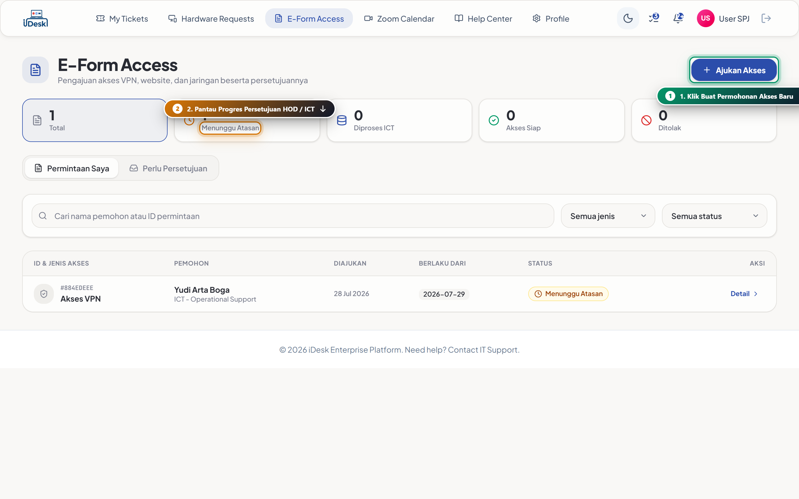

- **Kartu Ringkasan Status**: Memantau jumlah total permohonan, tiket yang *Menunggu Atasan*, *Diproses ICT*, *Akses Siap*, maupun *Ditolak*.
- **Tombol Ajukan Akses**: Klik tombol **`+ Ajukan Akses`** di kanan atas untuk membuat permohonan baru.

---

### 6.2 Mengisi Formulir Permintaan Akses Baru
Halaman pengajuan akses baru (**`/client/eform-access/new`**) memiliki alur validasi formulir terstruktur.

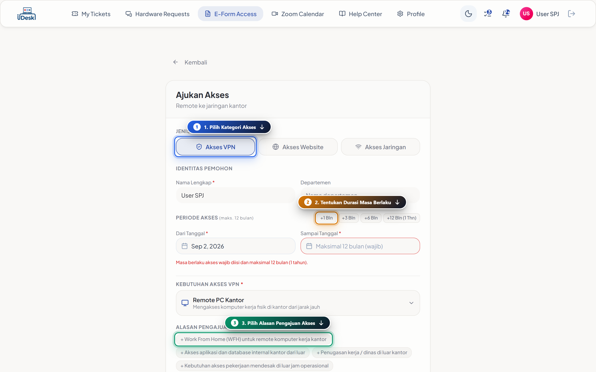

### 📌 Langkah Pengisian Formulir:
1. **Pilih Jenis Akses**:
   - 🛡️ **Akses VPN**: Akses koneksi remote dari luar kantor menuju server perusahaan.
   - 🌐 **Akses Website**: Pembukaan filter/whitelist situs web kerja tertentu.
   - 📶 **Akses Jaringan**: Hak akses WiFi atau VLAN divisi khusus.
2. **Identitas Pemohon**:
   - Nama lengkap dan departemen Anda akan terisi otomatis berdasarkan data kepegawaian.
3. **Periode Masa Berlaku Akses**:
   - Tentukan tanggal mulai (`Dari Tanggal`) dan tanggal selesai (`Sampai Tanggal`).
   - Tersedia tombol cepat: `+1 Bln`, `+3 Bln`, `+6 Bln`, atau `+12 Bln` (Maksimal masa berlaku adalah 12 bulan per pengajuan).
4. **Kebutuhan & Alasan Pengajuan**:
   - Pilih skenario kebutuhan (misal: *Remote PC Kantor*, *Akses Database*).
   - Pilih atau ketik alasan operasional (misal: *Work From Home*, *Penugasan Dinas Luar Kantor*).
5. **Kirim Permohonan**:
   - Tekan tombol kirim. Sistem akan meneruskan notifikasi persetujuan (*Approval Workflow*) secara berjenjang ke email Head of Department (HOD) Anda sebelum dieksekusi oleh tim ICT Security.

---

## Bab 7: Pusat Bantuan & Solusi Mandiri (Knowledge Base)

Sebelum membuat tiket baru, Anda sangat disarankan untuk mencari solusi cepat pada portal **Knowledge Base (`/client/kb`)**. Halaman ini memuat ratusan artikel panduan teknis yang disusun oleh tim IT Support.

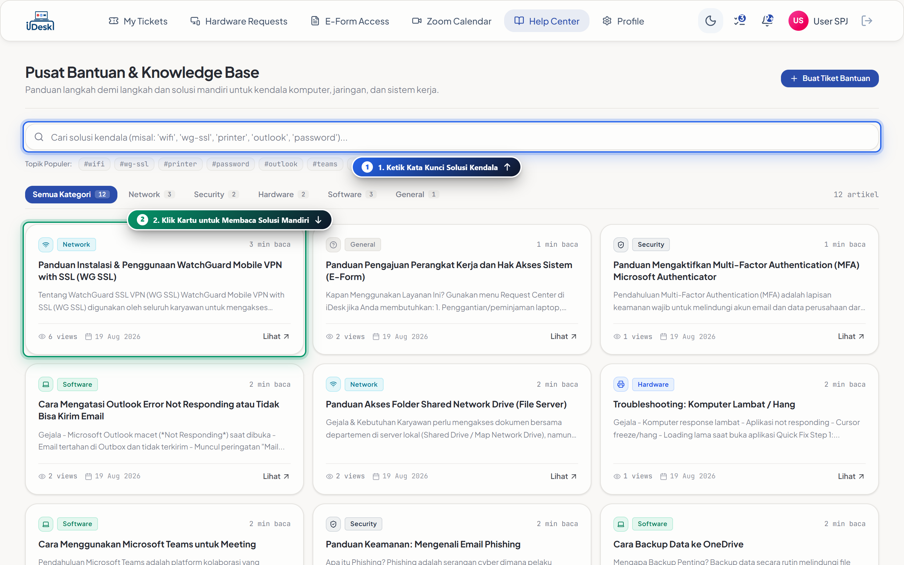

### 🔍 Cara Menggunakan Knowledge Base:
1. **Kotak Pencarian Pintar**:
   - Ketik kata kunci kendala Anda pada kotak pencarian (contoh: `wifi`, `vpn`, `printer`, `outlook`, `password`, `teams`).
2. **Kategori & Topik Populer**:
   - Gunakan pill navigasi kategori: `Semua Kategori`, `Network`, `Security`, `Hardware`, `Software`, atau `General`.
   - Klik tag tagar populer (*#wifi*, *#wg-ssl*, *#printer*, *#outlook*) untuk melihat artikel spesifik.
3. **Membaca & Mencetak Artikel**:
   - Klik pada kartu artikel untuk membuka konten panduan langkah demi langkah lengkap dengan gambar dan instruksi penanganan mandiri (*Self-Resolution*).
   - Anda dapat menekan tombol *Helpful (Bermanfaat)* jika artikel tersebut berhasil menyelesaikan kendala Anda.

---

## Bab 8: Notifikasi & Pengaturan Profil Pengguna

Anda dapat mempersonalisasi akun dan memantau pembaruan tiket melalui halaman **Profile Settings (`/client/profile`)**.

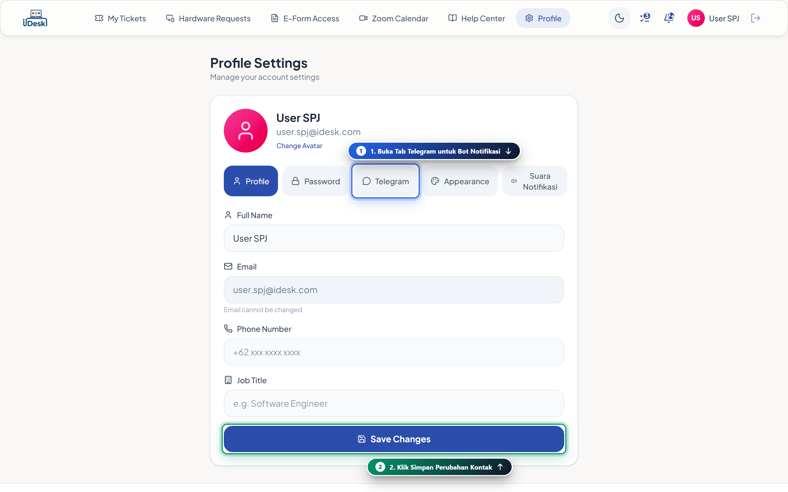

### ⚙️ Menu Pengaturan Akun:
1. **Tab Profil (`Profile`)**:
   - Memeriksa nama lengkap, email resmi, nomor telepon, dan jabatan (*Job Title*).
   - Anda dapat memperbarui nomor WhatsApp/telepon aktif agar teknisi dapat menghubungi Anda saat koordinasi perbaikan di lapangan.
2. **Tab Kata Sandi (`Password`)**:
   - Mengubah kata sandi login secara berkala demi menjaga keamanan data perusahaan.
3. **Tab Telegram & Notifikasi (`Telegram / Sound`)**:
   - Menghubungkan akun Telegram Anda dengan iDesk Bot untuk menerima notifikasi status tiket langsung di smartphone secara instan.
4. **Tema Tampilan (`Appearance`)**:
   - Mengganti tema antarmuka antara **Light Mode** (Mode Terang) dan **Dark Mode** (Mode Gelap) sesuai kenyamanan visual Anda melalui tombol toggle di sudut kanan atas bar navigasi.

---

## 📞 Butuh Bantuan Tambahan?
Jika Anda mengalami kendala yang tidak tercantum dalam panduan ini atau membutuhkan bantuan darurat (*Emergency IT Support*):
- **Portal Helpdesk**: [Buat Tiket Layanan di iDesk](https://idesk.santos.co.id/client/create)
- **Email IT Support**: `it.support@santos.co.id`
- **Operasional Layanan**: Senin – Jumat, 08:00 – 17:00 WIB

---
*Dokumentasi Resmi iDesk Enterprise Platform — PT Santos Jaya Abadi (Kapal Api Group)*
*Versi: 3.18.2 — Terakhir Diperbarui: September 2026*
