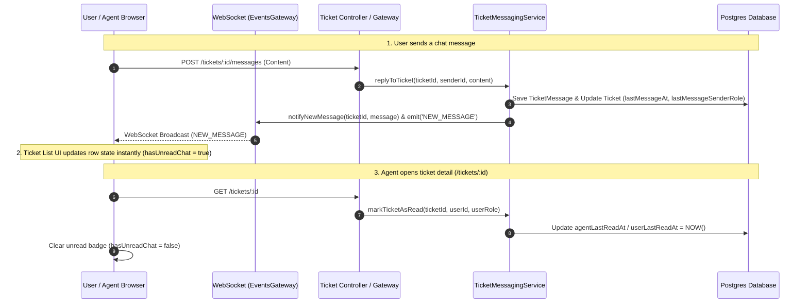

# Realtime Unread Chat Notification Design

**Date:** 2026-07-22  
**Status:** Approved  
**Scope:** `apps/backend` (Ticketing module), `apps/frontend` (`tickets/list` & `oracle-k2-request` pages)

---

## 1. Executive Summary

Halaman daftar tiket (`/tickets/list`) dan Oracle K2 Request (`/tickets/oracle-k2`) memerlukan indikator visual **realtime** ketika terdapat pesan chat baru dari pihak seberang (User ke Agent atau Agent ke User) yang belum dibaca. Indikator ini harus diperbarui secara **realtime via WebSocket tanpa refresh halaman (F5)** dan otomatis hilang setelah tiket detail dibuka.

---

## 2. Requirements & User Intent

1. **Dua Arah (2-Way Notification):**
   * Jika **User/Requester** mengirim chat $\rightarrow$ **Agent/Admin** melihat indikator `Pesan Baru` pada baris tiket di daftar tiket Agent/Admin.
   * Jika **Agent/Admin** mengirim balasan chat $\rightarrow$ **User/Requester** melihat indikator `Pesan Baru` pada baris tiket di daftar tiket User.
2. **Pembersihan Otomatis (*Mark as Read*):**
   * Indikator `Pesan Baru` hilang secara otomatis ketika pengguna/agent mengeklik baris tiket dan masuk ke halaman Detail Tiket (`/tickets/:id`).
3. **Realtime Updates (Zero Refresh):**
   * Ketika ada pesan baru masuk via WebSocket (`NEW_MESSAGE` / `ticket:newMessage`), halaman daftar tiket yang sedang terbuka di browser agent/user langsung memperbarui state baris tiket secara instan tanpa perlu reload.
4. **Visual Aesthetics:**
   * Badge berbentuk **Warm Amber Pill** dengan icon `MessageSquare`, teks `Pesan Baru (x)`, animasi *subtle pulse*, serta dukungan Dark Mode.

---

## 3. System Architecture & Component Design



---

## 4. Detailed Technical Specifications

### 4.1 Backend (TypeORM Entity & Services)

#### A. Database Schema Update (`Ticket` Entity)
File: `apps/backend/src/modules/ticketing/entities/ticket.entity.ts`
Tambahkan 4 field timestamp pada entity `Ticket`:
```typescript
@Column({ type: 'timestamp', nullable: true })
lastMessageAt: Date | null;

@Column({ type: 'varchar', nullable: true })
lastMessageSenderRole: string | null; // 'USER' | 'AGENT' | 'ADMIN'

@Column({ type: 'timestamp', nullable: true })
userLastReadAt: Date | null;

@Column({ type: 'timestamp', nullable: true })
agentLastReadAt: Date | null;
```

#### B. Computed Field pada `TicketQueryService`
File: `apps/backend/src/modules/ticketing/services/ticket-query.service.ts`
Saat query list tiket (`findAll`, `findOracleTickets`, dsb.):
* Hitung status unread berdasarkan `currentUser.role`:
  * Untuk **AGENT / ADMIN**:
    `hasUnreadChat = lastMessageSenderRole === 'USER' && (!agentLastReadAt || lastMessageAt > agentLastReadAt)`
  * Untuk **USER**:
    `hasUnreadChat = (lastMessageSenderRole === 'AGENT' || lastMessageSenderRole === 'ADMIN') && (!userLastReadAt || lastMessageAt > userLastReadAt)`
* Sertakan field `hasUnreadChat: boolean` dan `unreadMessageCount: number` pada response list DTO.

#### C. Auto Mark-As-Read
File: `apps/backend/src/modules/ticketing/services/ticket-messaging.service.ts`
* Saat `replyToTicket(...)` dipanggil:
  * Update `ticket.lastMessageAt = new Date()` dan `ticket.lastMessageSenderRole = user.role`.
  * Update `ticket.agentLastReadAt = new Date()` (jika pengirim agent) atau `ticket.userLastReadAt = new Date()` (jika pengirim user).
* Tambahkan method `markAsRead(ticketId: string, user: User)`:
  * Dipanggil saat pengguna/agent mengakses endpoint detail tiket (`GET /tickets/:id`).
  * Update `agentLastReadAt = new Date()` jika `user.role` adalah Agent/Admin.
  * Update `userLastReadAt = new Date()` jika `user.role` adalah User.

---

### 4.2 Frontend (React & Socket.io)

#### A. Ticket Interface (`TicketListRow.tsx`)
File: `apps/frontend/src/features/ticket-board/components/TicketListRow.tsx`
Tambahkan atribut `hasUnreadChat` & `unreadMessageCount` pada interface `TicketRowData`:
```typescript
export interface TicketRowData {
    // ...existing properties
    hasUnreadChat?: boolean;
    unreadMessageCount?: number;
}
```

#### B. Component Rendering
Di sebelah judul tiket dalam `TicketQuickPreview` / title container:
```tsx
{ticket.hasUnreadChat && (
    <span className="inline-flex items-center gap-1 px-2.5 py-0.5 rounded-full text-xs font-semibold bg-amber-50 text-amber-700 border border-amber-300 dark:bg-amber-950/50 dark:text-amber-300 dark:border-amber-700/60 shadow-sm animate-pulse shrink-0">
        <MessageSquare className="w-3.5 h-3.5 text-amber-600 dark:text-amber-400" />
        <span>Pesan Baru{ticket.unreadMessageCount ? ` (${ticket.unreadMessageCount})` : ''}</span>
    </span>
)}
```

#### C. Realtime Socket Integration
File: `apps/frontend/src/features/ticket-board/pages/BentoTicketListPage.tsx` & `BentoOracleK2TicketsPage.tsx`
* Menggunakan socket hook `useSocket` / `getSocket()`:
* Listen event `NEW_MESSAGE` / `ticket:newMessage`:
  ```typescript
  useEffect(() => {
      const socket = getSocket();
      if (!socket) return;

      const handleNewMessage = (data: { ticketId: string; message: any }) => {
          if (data.message.senderId !== currentUser?.id) {
              setTickets((prevTickets) =>
                  prevTickets.map((t) =>
                      t.id === data.ticketId
                          ? { ...t, hasUnreadChat: true, unreadMessageCount: (t.unreadMessageCount || 0) + 1 }
                          : t
                  )
              );
          }
      };

      socket.on('NEW_MESSAGE', handleNewMessage);
      socket.on('ticket:newMessage', handleNewMessage);

      return () => {
          socket.off('NEW_MESSAGE', handleNewMessage);
          socket.off('ticket:newMessage', handleNewMessage);
      };
  }, [currentUser?.id]);
  ```

---

## 5. Verification & Testing Plan

1. **Unit Tests (Backend):**
   * Verifikasi `replyToTicket` meng-update `lastMessageAt` dan `lastMessageSenderRole`.
   * Verifikasi `markAsRead` meng-update `agentLastReadAt` atau `userLastReadAt`.
   * Verifikasi kalkulasi `hasUnreadChat` mengembalikan `true` hanya untuk role penerima.

2. **Integration & Manual Verification:**
   * Login sebagai User A di browser 1, buka detail tiket `#220726-GEN-0001` dan kirim pesan chat.
   * Login sebagai Agent B di browser 2, berada di halaman `/tickets/list`.
   * **Ekspektasi:** Tanpa refresh (F5), baris tiket `#220726-GEN-0001` di browser Agent B langsung memunculkan badge amber `Pesan Baru (1)` yang berdenyut.
   * Agent B mengeklik tiket `#220726-GEN-0001` untuk melihat detail.
   * Agent B kembali ke daftar tiket.
   * **Ekspektasi:** Badge `Pesan Baru` pada tiket `#220726-GEN-0001` telah hilang.
